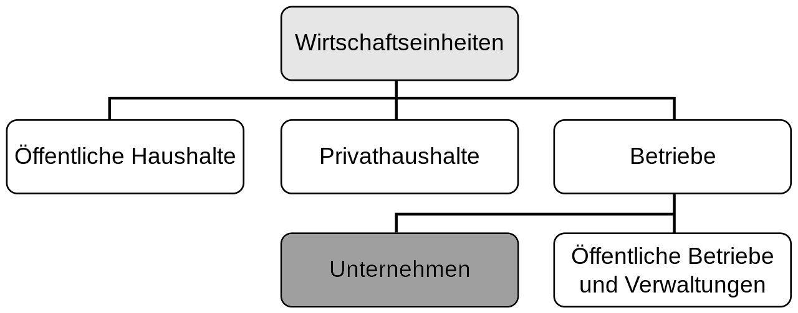

<!--markdownlint-disable-->
Allgemeine Betriebswirtschaftslehre
===================================

<!-- START doctoc generated TOC please keep comment here to allow auto update -->
<!-- DON'T EDIT THIS SECTION, INSTEAD RE-RUN doctoc TO UPDATE -->
**Inhaltsverzeichnis**

- [Unternehmensführung - Produktionsfaktoren, betriebliche Funktionsbereiche](#unternehmensf%C3%BChrung---produktionsfaktoren-betriebliche-funktionsbereiche)
  - [Begriffe](#begriffe)
  - [Merkmale eines Unternehmens](#merkmale-eines-unternehmens)
  - [Wirtschaftliches System](#wirtschaftliches-system)
  - [Rechtsformen](#rechtsformen)
  - [Marktbeurteilung](#marktbeurteilung)
  - [Einflussfaktoren](#einflussfaktoren)
  - [Unternehmensführung](#unternehmensf%C3%BChrung)
  - [Aufgaben eines Unternehmens](#aufgaben-eines-unternehmens)
    - [Kurzfristige Auffassungen (operativ)](#kurzfristige-auffassungen-operativ)
  - [Management](#management)
  - [Kontrolle vs Controlling](#kontrolle-vs-controlling)
  - [Teilaufgaben der Unternehmensführung](#teilaufgaben-der-unternehmensf%C3%BChrung)
  - [Führung und Leitung](#f%C3%BChrung-und-leitung)
  - [Organisationsformen](#organisationsformen)
    - [Inhalt einer Stelle](#inhalt-einer-stelle)
    - [Möglichkeiten der Führungshierarchie](#m%C3%B6glichkeiten-der-f%C3%BChrungshierarchie)
      - [Zentralität](#zentralit%C3%A4t)
      - [Dezentralität](#dezentralit%C3%A4t)
  - [Darstellung der Organisation](#darstellung-der-organisation)
    - [Moderne Stellenbeschreibung](#moderne-stellenbeschreibung)
    - [Organigramm](#organigramm)
    - [Informationsfluss](#informationsfluss)
    - [Umsetzung von Verantwortung](#umsetzung-von-verantwortung)
  - [Systemeinteilung](#systemeinteilung)
    - [Linienorganisation](#linienorganisation)
- [Personalplanung, -Bedarf, -Deckung, -Entwicklung](#personalplanung--bedarf--deckung--entwicklung)
  - [Personalbedarfsplanung](#personalbedarfsplanung)
    - [Bedingungen](#bedingungen)
    - [Einordnung](#einordnung)
    - [Verfahren der Personalplanung](#verfahren-der-personalplanung)
      - [Faustformel REFA](#faustformel-refa)
      - [Vorwärtskalkulation](#vorw%C3%A4rtskalkulation)
      - [Rückwärtskalkulation](#r%C3%BCckw%C3%A4rtskalkulation)
      - [vergangenheitsorientierte Methoden](#vergangenheitsorientierte-methoden)
    - [Quantitative Planung](#quantitative-planung)
    - [Stellenplanmethode](#stellenplanmethode)
    - [Kennzahlmethode](#kennzahlmethode)
    - [Schätzmethode](#sch%C3%A4tzmethode)
    - [Methods-Time-Measurement-Analysis](#methods-time-measurement-analysis)
    - [REFA](#refa)
- [Externes Rechnungswesen](#externes-rechnungswesen)
- [Internes Rechnungswesen](#internes-rechnungswesen)
- [Investition und Finanzierung](#investition-und-finanzierung)
- [Protektionswirtschaft](#protektionswirtschaft)
- [Marketing](#marketing)

<!-- END doctoc generated TOC please keep comment here to allow auto update -->

<!--newpage-->
<!--markdownlint-enable-->

# Unternehmensführung - Produktionsfaktoren, betriebliche Funktionsbereiche

## Begriffe

- **Betrieb:** Ort der Leistungserbringung
- **Unternehmen:** ganzheitliche, rechtliche, finanzielle und wirtschaftliche Einheit des Betriebs

## Merkmale eines Unternehmens

- komplexes System aus Ressourcen (HR, MR, FR)
  - HR = Mitarbeiter mit Fähigkeiten, Fertigkeiten, Wissen und Erfahrungen
  - MR = Maschinen, Gebäude, Material, Lizenzen
  - FR = Finanzielle Mittel -> Eigen- und Fremdkapital
- weitgehend autonome Festlegung von Zielen -> **Autonomieprinzip**
- MA bilden **soziales System** (Gruppen, Teams, Abteilungen, ...) -> ausgerichtet auf Leistungserbringung (erwerbswirtschaftliches Prinzip), Austausch mit Unternehmensumwelt (Markt)

## Wirtschaftliches System

- Markt/Ökonomie: Input-/Output-Beziehungen = Kaufen + Verkaufen
- Umwelt: Schonung der Ressourcen
- Soziale Beziehungen: Gesellschaftliche Rahmenbedingungen

> Drei Säulen der Nachhaltigkeit

<!--height=200px-->

## Rechtsformen

**Personengesellschaften**

- meist Eigentümer-geführte Unternehmen
- Einzelkaufmann, GbR, OHG

**Kapitalgesellschaften**

- Eigentum und Geschäftsführung sind getrennt (Aktionäre <-> Vorstand)
- GmbH, AG

## Marktbeurteilung

- **Polypol:** viele Anbieter, viele Nachfrager
- **Oligopol:** wenige Anbieter bzw. wenige ein Nachfrager
- **Monopol:** ein Anbieter bzw. ein Nachfrager

## Einflussfaktoren

- Gesellschaftsordnung: Kapitalismus
- Politische Ordnung: Föderalismus
- Wirtschaftsordnung: soziale Marktwirtschaft
- Rechtsordnung: Verfassungs-, Straf-, Privat- und Öffentliches Recht

> Die Einflussfaktoren wirken gemeinsam auf die Unternehmenspolitik ein

## Unternehmensführung

- Kapitalismus -> langfristige Gewinnmaximierung (**erwerbswirtschaftliches Prinzip**)
- einheitliche Führung notwendig (Prinzip des Privateigentums)
- Hauptaufgabe: Definition und Überwachung (Controlling) der betrieblichen Zielsetzungen (Gewinn) = **Autonomieprinzip**
- Führen als Entscheidungskonzept der Organisation

## Aufgaben eines Unternehmens

- **strategisches Ziel:** langfristige (\geq\geq 5y) Erarbeitung, Überarbeitung und Verankerung der Werte und der unternehmerischen Vision
- **Position des Unternehmens:** Strategieentwicklung und Positionierung; SWOT-Analyse $\rightarrow$ Platz am Markt bestimmen
- **Koordination der Ressourcen:** Koordination von HR+MR+FR in zeitlich räumlichen Rahmen
- **Ökologie des Unternehmens:** Lebenszykluskontrolle der Produkte und Dienstleistungen auf Basis ökologischer Notwendigkeiten
- **Kundenorientierung:** Ermittlung des Nutzen für den Kunden der Produkte und Dienstleistungen im strategischen Zeitraum ("Kunden das Gefühl geben, wichtig zu sein")
- **persönliche Entwicklung:** permanente Entwicklung der unternehmerischen Persönlichkeit

> Leitbild = formuliert kurz und prägnant die strategischen Zieles und die wesentlichen Orientierungen für Art und Weise ihrer Umsetzung

- Unternehmenskultur stellt den Ist-Zustand dar
  - Know-How: Forschung und Entwicklung; **KVP** (kontinuierlicher Verbesserungs-Prozess)
  - Ökonomie: Verhältnis zw. Eigen- und Fremd-Kapital
  - (positive) soziale Beziehungen: Kundengefühl; Mitarbeiter als Bestandteil der Leistungsfähigkeit

### Kurzfristige Auffassungen (operativ)

- **Verkauf:** Vertrieb
- **Finanzierungsplanung:** Geschäftsführer
- **Finanzielle Förderung:** Finanzbereich
- **Kunden ansprechen:** Marketing und Vertrieb
- **Jahresabschluss:** Geschäftsführer und Finanzbereich
- **Konflikte mit Kunden austragen:** Geschäftsführung
- **Innerbetriebliche Organisation:** Management
- **Systeme schaffen:** Geschäftsführung und Management

## Management

> Management sind Personen, Organisationen oder Leitungsfunktionen, die die Funktionen der Planung, Organisation, Führung und Controlling in einem Unternehmen ausüben

- **Institutionell:** Person(-gruppen) die in Rangfolge einer Organisation dargestellt werden (*Organigram*)
- **Funktionell:** Handlung des Führens einer Organisation durch Zielsetzung, Planen, Organisieren, Realisieren und Controlling
- **Funktionales Management** = Kreislauf aus: Planning, Organizing, Staffing, Directing, Controlling

## Kontrolle vs Controlling

- **Kontrolle** der Aufgabe/Zielstellung
- **Controlling:** Einflussnahme/Lenkung/Steuerung $\rightarrow$ Differenz zum erreichenden Ziel $\rightarrow$ Rückkoppelung zur Einflussnahme

## Teilaufgaben der Unternehmensführung

Gewinnmaximierung durch:

- Liquidität: Erwirtschaften von Financial Resources
- Nachfrage: Bedarf für Produkte/Dienstleistungen
- Absatz: Verkauf der Produkte/Dienstleistungen
- Wachstum: kontinuierliche Verbesserung
- Beschäftigung: Sicherung von Arbeitsplätzen, inkl. Arbeitsmoral

## Führung und Leitung

- **Führung:** Beeinflussung von Personen zur Erfüllung von Zielen und Aufgaben (personenbezogen $\rightarrow$ aktive Einflussnahme auf Handlungen von Personen)
- **Leitung:** formelle Machtausübung zur Erfüllung von Aufgaben und Zielen (funktionsbezogen $\rightarrow$ reaktive und sachbezogene Einflussnahme auf Handlung von Personen)

## Organisationsformen

- Aufbau/Struktur des Unternehmens
- Instanzen: Stellen mit Leitungsfunktion
- Hierarchien: Ebenen im Unternehmen mit gleichen oder ähnlichen Befugnissen
- Formelle Beziehungen: <!--???-->

Bildung von Organisationseinheiten: Stellen (AP) $\rightarrow$ Gruppen $\rightarrow$ Abteilungen $\rightarrow$ ...

- Festlegung der Strukturen: Organisationseinheiten, Zentralisation/Dezentralisation, Tätigkeiten, Aufgabenträger, Informationswege, Aufgaben/Kompetenz(Befugniss)/Verantwortung(Aufgabenerfüllung)
- Arbeitsteilung (Beispiel): Planung, Einkauf, Vorfertigung, Montage, Kommissionierung, Vertrieb, Service

### Inhalt einer Stelle

- Ausführungsfunktion
- Leitungsfunktion: Zeit- und Selbstmanagement
  - Anforderungen: fachliche, methodische, persönliche Kenntnisse
- Kompetenz (Befugnisse) einer Stelle: Weisung, Entscheidung, Verfügung (Grundsätzliche Entscheidung), Vertretung, Information
- Stellen mit gleicher Befugnis = Hierarchieebene

### Möglichkeiten der Führungshierarchie

- **Zentralität:** von einer Stelle für alle Unternehmensteile verbindlich festgelegt
  - schnelle, einheitliche Führung und Entscheidung; ohne Differenzierung auf individuelle Gegebenheiten; geringe Akzeptanz vor Ort
- **Dezentralität:** an der Stelle entschieden, die die höchste Kompetenz hat
  - Führung und Entscheidung vor Ort \rightarrow\rightarrow hohe Akzeptanz; langsame Entscheidungsfindung; Notwendigkeit autonomer Gruppen

#### Zentralität

- **Vorteile:** einheitliche Vorgaben; gutes Controlling; geringer Aufwand der Umsetzung (autoritär)
- **Nachteile:** fehlende Berücksichtigung individueller Bedingungen; geringe Akzeptanz, Identifikation bei Mitarbeitern; Ausschluss individueller Stärken

#### Dezentralität

- **Vorteile:** Berücksichtigung individueller Bedingungen; hohe Akzeptanz, Identifikation bei Mitarbeitern; Nutzen individueller Stärken
- **Nachteile:** keine einheitlichen Vorgaben möglich; aufwendiges individuelles Controlling; hoher Aufwand der Umsetzung (kooperativ)

## Darstellung der Organisation

### Moderne Stellenbeschreibung

- Rahmen für Mitarbeiter in der Organisation
- Anforderungsprofil: fachlich, methodisch, persönlich
- Aufgabenbeschreibung: Bezeichnung, Über-/Unterstellung, wesentliche Aufgaben, Ziele, Befugnisse, Verantwortung, Vertretung

### Organigramm

- Hierarchische Unterstellung oder Aufgabenverteilung (Beziehungen)

### Informationsfluss

**Formelle Wege**

- Top-Down: Entscheidung/Ziel/Aufgabe wird weitergegeben
- Bottom-Up: Informationen kommen vom Arbeitsplatz

**Informelle Wege**

- "Kleiner Dienstweg", "Buschfunk"

### Umsetzung von Verantwortung

- **Definition:** Übergabe durch den Vorgesetzten $\rightarrow$ Übernahme durch den Mitarbeiter $\rightarrow$ Pflicht der Aufgabe/Ziel (Erfüllung) = Verantwortung

**Verantwortung in der Centerorganisation**

- = Betrachtung des Kapitalflusses
- Investment-Center: RoI - Return on Investment
- Profit-Center: Aufgabe Gewinn zu erwirtschaften
- Cost-Center: Verteilung von Kosten
- Umsatz/Revenue-Center: Umsatz-Leistung

## Systemeinteilung

>
> Hier müsste Einiges noch aus den Folien übernommen werden.
>

### Linienorganisation

- **Einliniensystem:** Verrichtungszentralisation, Einfachunterstellung, Vollkompetenz (= Fachkompetenz + disziplinarische Kompetenz)
- **Mehrliniensystem:** Verrichtungszentralisation, Mehrfachunterstellung, Voll- und Teilkompetenzen
- **Stabsliniensystem:** Verrichtungszentralisation, Einfachunterstellung, Voll- und Teilkompetenzen

# Personalplanung, -Bedarf, -Deckung, -Entwicklung

## Personalbedarfsplanung

- **strategisch:** > 5 Jahre; langfristig, grundlegende Ziele
- **taktisch:** > 1 bis 5 Jahre; mittelfristig, Teilziele (Ausbildung)
- **operativ:** kurzfristig; Prozesssteuerung (Urlaubsplan)
- je länger der Planungshorizont umso weniger Planungssicherheiten

### Bedingungen

- Dienstverhältnis $\rightarrow$ Arbeitsvertrag
- Gewerbeordnung $\rightarrow$ z.B. Weisungsrecht
- Arbeitszeitgesetz, Arbeitsschutzgesetz, Jugendschutzgesetz
- Tarifverträge, Betriebsvereinbarung, ...
- Einzelvereinbarungen in Arbeitsverträgen
- Personalstruktur (Vollzeit, Teilzeit, Einsatzschlüssel, ...)
- Aufbau- und Ablauforganisation
- Fehlzeiten, Fluktuation

### Einordnung

- **Anzahl:** Besetzung der Ebenen der Hierarchie, Menge MA, Verhältnis FK <-> MA
- **Qualifikation:** Ausbildung und Fähigkeiten der MA (fachlich, methodisch, persönlich)
- **Zeitpunkt:** Zeitpunkt der Aufgabestellung und -erledigung
- **Einsatzort:** interne und externe Arbeitsplätze

### Verfahren der Personalplanung

- **vergangenheitsorientiert:** Trendexploration
- **Schätzmethoden:** Schätzverfahren
- **organisatorisch:** Stellenplanmethode
- **Personalbemessungsmethoden:** REFA-Methode (Zerlegung in Arbeitsschritte)

#### Faustformel REFA

$$\frac{\text{Anzahl der Bedieneinheiten}\times\text{Arbeitszeitbedarf pro Bedieneinheit und Periode}}{\text{Arbeitszeit pro Arbeitskraft und Periode}}=\text{Personalbedarf (quantitativ)}$$

$$\frac{\text{Anzahl der zu erbringenden Sachleistungen pro Periode}\times\text{Arbeitszeit pro Leistungseinheit}}{\text{Arbeitszeit pro Arbeitskraft und Periode}}=\text{Personalbedarf (quantitativ)}$$

#### Vorwärtskalkulation

$$\begin{matrix}&&\text{Personalbestand}&&t_0\\
+&&\text{voraussichtliche Zugänge}&&t_0\text{ bis }t_x\\
-&&\text{voraussichtliche Abgänge}&&t_0\text{ bis }t_x\\
\hline\\
=&&\text{voraussichtlicher Personalbestand}&&t_x\\
+/-&&\text{Saldo aus Veränderungsentscheidungen}&&\text{Personalauf-/abbau}\\
\hline\\
=&&\text{Personalbestand}&&t_x^0
\end{matrix}$$

> positiver Saldo = Mehrbedarf
> negativer Saldo = Freistellung

#### Rückwärtskalkulation

$$\begin{matrix}&&\text{Personalbestand aus entsprechenden Veränderungsentscheidungen}&&t_x\\
+&&\text{voraussichtliche Abgänge}&&t_0\text{ bis }t_x\\
-&&\text{voraussichtliche Zugänge}&&t_0\text{ bis }t_x\\
-&&\text{Personalbestand}&&t_0\\
\hline\\
=&&\text{Saldo aus Veränderungsentscheidungen}\\
\end{matrix}$$

> positiver Saldo = Mehrbedarf
> negativer Saldo = Freistellung

#### vergangenheitsorientierte Methoden

- Kennzahlen: Mitarbeiter werden für best. Kennzahl benötigt
- Stellenplan: Stellenwegfall und notwendige Stellen berechnen
- Trend-Extrapolation: Bestimmung des Entwicklungstrends im Unternehmen
- Analogie-Schlussmethode: Betriebliche Vorgänge werden Zeitaufwand und somit nötigem Personalbedarf gegenübergestellt

### Quantitative Planung

- = Gründe für den Einsatz von Personal
- **Ersatz-Bedarf:** Natürliche und künstliche Fluktuation
- **Neu-Bedarf:** Expansion, Neue Prozesse
- **Mehr-Bedarf:** Saisonale Strukturveränderungen
- **Reserve-Bedarf:** Ausfallbedarfe, befristeter Bedarf
- **Nachhol-Bedarf:** Unbesetzte Kapazitäten, neue Aufgaben

<!--ANMERKUNG: Berechnung Personalbedarf wahrscheinlich in Klausur-->

### Stellenplanmethode

**1. Ermittlung des Bruttopersonalbedarfs**

$$\begin{matrix}&&\text{gegenwärtig vorhandene Stellen laut Ermittlungsmethode}\\
+&&\text{neue Bedarfsstellen im Planungszeitraum}\\
-&&\text{entfallende Stellen im Planungszeitraum}\\
\hline\\
&&\text{Bruttopersonalbedarf}\\
\end{matrix}$$

**2. Ermittlung des Personalbestandes**

$$\begin{matrix}&&\text{gegenwärtiger Persoalbestand}\\
+&&\text{feststehende Personalzugänge}\\
-&&\text{Personalabgänge}\\
\hline\\
&&\text{fortgeschriebener Personalbestand}\\
\end{matrix}$$

**3. Ermittlung des Nettopersonalbedarfes**

$$\begin{matrix}&&\text{Bruttopersoalbestand}\\
-&&\text{fortgeschriebener Personalbestand}\\
\hline\\
&&\text{Nettopersonalbedarf}\\
\end{matrix}$$

<!--LKF: Warum können Bruttopersonalbedarf und fortgeschriebener Personalstand differieren?-->

### Kennzahlmethode

- Spekulation an die zu erartenden Kennzahlen
- vorhandene Mitarbeiter pro Umsatz/Ertrag
- Multipliziert mit zu erwartendem Umsatz/Ertrag

### Schätzmethode

- einfache Methode: Expertenschätzung
- systematische Verfahren: Expertenschätzung unter Einbeziehung von Kennzahlen $\rightarrow$ Delphi-Methode

### Methods-Time-Measurement-Analysis

- Teilen von Arbeitsabläufen in kleinste Arbeitschritte
- Quotient aus Gesamtzeit und vereinbarter Arbeitszit ergibt notwendiges Material
- Vorsicht: wechselnde Menschliche Kondition; Urlaub, Pausen, Krankheit ($\rightarrow$ Ideal bei Industrierobotern)

### REFA

Unterscheidung in:

- Rüstzeit (Arbeitsvorbereitung)
- Grundzeit (Arbeitsdurchführung pro Werkstück)
- Erholzeit (notwendige, gesetzliche Pausen)
- Verteilzeit (Puffer für Unvorhergesehenes, z.B. Ausfälle)
- Belegungszeit (Nutzung der Betriebsmittel)
- Durchlaufzeit = Gesamtzeit des Auftrages

Sollzeitanalyse = Vergleich der SOLL- und gemessenen IST-Zeiten

# Externes Rechnungswesen

# Internes Rechnungswesen

# Investition und Finanzierung

# Protektionswirtschaft

# Marketing
