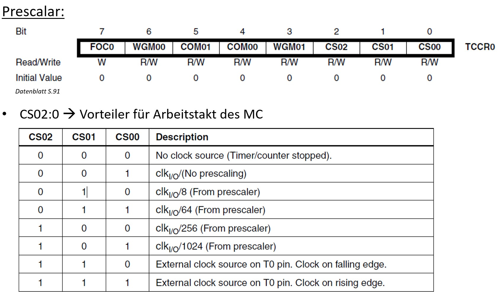

Praktikum hardwarenahe Programmierung
=====================================

<!-- START doctoc generated TOC please keep comment here to allow auto update -->
<!-- DON'T EDIT THIS SECTION, INSTEAD RE-RUN doctoc TO UPDATE -->
**Inhaltsverzeichnis**

- [AVR ATmega 8515L](#avr-atmega-8515l)
- [Direktiven und Kommandos](#direktiven-und-kommandos)
- [Programmieren mit AVR Studio](#programmieren-mit-avr-studio)
  - [Dateistruktur](#dateistruktur)
  - [I/O](#io)
  - [Register](#register)
- [Interrupts](#interrupts)
  - [Aufbau der IV-Tabelle](#aufbau-der-iv-tabelle)
  - [externe Interrupts](#externe-interrupts)
- [Stack](#stack)
- [Funktionen und Makros](#funktionen-und-makros)
- [Zeitsteuerung](#zeitsteuerung)
- [Unterprogramme](#unterprogramme)
- [Timer](#timer)
- [Programmspeicher](#programmspeicher)
- [Serielle Schnittstelle](#serielle-schnittstelle)

<!-- END doctoc generated TOC please keep comment here to allow auto update -->

<!--newpage-->

# AVR ATmega 8515L

- 40 Pins, 4 Ports, 2 Pins f. externen Takt
- 8 Bit RISC Microcontroller
- 8 kB Flash <!--Whoa-->
- 512 Byte EEPROM
- 512 Byte SRAM
- bis zu 64 kB externen SRAM
- 8 Bit + 16 Bit Zähler
- 0 bis 8 MHz
- interne und externe Interrupts
- interner Watchdog (mit Brownout Detection)
- CPU entspricht Harvard-Architektur und unterstützt Single Level Pipelining
- RAM: Adresse ``0x60``
- Stack: wächst von unten nach oben; Pointer muss initialisiert werden
- LED und Taster *auf dem Entwicklerboard* sind **Low-aktiv** (verhindert Störungen beim Start)
- Statusregister: Informationen zu Ergeignissen von arithmetischen und logischen Operationen, wie z.B. Zero-Flag
  - Besonderheit `I`-Flag: muss manuell auf 1 gesetzt werden, wenn Interrupts behandelt werden sollen
- PIN-Register laufen dem PORT-Register um einen Takt nach

# Direktiven und Kommandos

- Direktiven: Anweisungen für den Assembler (die Software), ähnlich zu C-Präprozessor
  - keine Maschinenbefehle
  - wichtig:
    - ``.include`` - analog zu C
    - ``.def`` - Aliase für Register
    - ``.equ`` - Definition einer Konstante, ähnlich zu ``#define``
    - ``.set`` - wie ``.equ``, aber nicht konstant <!--???-->
- Kommandos: entsprechen genau einem Maschinenbefehl; ca. 130
  - Speicheroperationen: ``LDI``, ``MOV``,...
  - Arithmetische und logische Operationen: ``ADD``, ``SUB``, ...
  - Manipulationen im Programmablauf: ``SIBS``, ``BREQ``,...
  - Kommentare
  - Ziel von Ergebnisdaten ist der **linke Operand**
  - jede Kombination von verwendeten Registern in einem Befehl bildet eigentlich einen separaten Befehl $\rightarrow$ Befehlssatz begrenzt

# Programmieren mit AVR Studio

## Dateistruktur

- in einem Kommentarblock soll Zweck des Programms festgehalten werden
- wir benötigen zunächst einen Dateikopf, in der wir die Gerätedatei laden:

```asm
.nolist
.include "m8515def.inc"
.list
```

- anschließend soll in einem Kommentarblock die Hardwarebeschreibung festgehalten werden, u.a.
  - welche Komponenten an welchen Pins?
  - welcher Takt?

```asm
.def work   = R16

.equ Taster0 = 0
```

- falls verwendet, folgen Makros, Funktionsbeschreibungen und Vektor-Interrupt-Tabelle
- es folgt die Initialisierung, z.B. mit Stack:

```asm
start:
;init Stack
ldi work, LOW(RAMEND)
out SPL, work
ldi work, HIGH(RAMEND)
out SPH, work
```

- Das Hauptprogramm läuft in einer Endlos-Schleife:

```asm
main:

rjmp main
```

- zuletzt folgen Unterprogramme und Nutzdaten

## I/O

- Port $\rightarrow$ Sammlung verschiedener Speicher
- ``DDRx``-Register: "Data Direction Register"; deklariert, ob ein Pin an einem Port ``x`` mithilfe des dazugehörigen Bits ein Eingang oder Ausgang ist
  - Beispiel: ``DDRB`` hat Wert 255 $\rightarrow$ alle Pins sind Ausgänge
- ``PORTx`` sendet Daten an Ausgänge
- ``PINx`` ist ein nur-lesen-Register $\rightarrow$ hier können Daten ausgelesen werden
- Befehle:
  - ``OUT``: schreibt Daten
  - ``IN``: liest Daten in ein Arbeitsregister
  - ``LDI``: liest Bit aus I/O-Register
  - ``SBI``: schreibt Bit in I/O-Register
  - ``CBI``: löscht Bit aus I/O-Register
  - ``SBIC``: Wenn Register cleared, dann überspringe nächste Anweisung

## Register

- 32 General Purpose Register sowie Spezialregister
- Register ``R16`` bis ``R31`` für spezielle Aufgaben
  - ``LDI``,  ``ANDI``, ``CBR``, ``SBR``, ``CPI``, ``SER``, ``ORI``, ``SBCI``, ``SUBI`` funktionieren erst ab ``R16``
- Zeigerregister ``X``, ``Y``, ``Z``
- Empfehlungen:
  - verwendeten Registern Namen zuweisen
  - für Zeiger R26 bis R31 reservieren
  - 16-Bit-Zähler mit R24/R25
  - für Zugriff auf Programmspeicher Z (R30/R31) und R0 reservieren
  - für Verwendung von Konstanten oder Bit-Auswertung R16 bis R23 vorsehen
  - Sichern des Status-Registers wenn möglich in R15

Hausaufgabe: LED-Zustand beim Drücken des Tasters umschalten

Lösung der Hausaufgabe:

```asm
.nolist
.include "m8515def.inc"
.list

/* STK500 -> 4MHz; LED an Pin A0, Taster an A1 */

.def work   = R16
.def eins   = R17

.equ LED = 0

; Initialisierung

start:

;init registers
;LDI work, 255
;OUT DDRB, work
LDI work, 253
OUT DDRA, work ; set Output-Flag on all Bits but 1
LDI work, 2
OUT PORTA, work ;  set Pull-Up Resistor on Bit 1
LDI work, 0
LDI eins, 1

; Hauptprogramm

main:

sbis PINA, 1
  rjmp main ; jump back if button not pressed

in work, PINA
eor work, eins
out PINA, work

loop:
sbic PINA, 1
rjmp loop

rjmp main

```

# Interrupts

- Aktivierung über `GICR`-Register, Konfiguration über `MCUCR`, `EMCUCR`-Register
- Behandlung via Interrupt Service Routinen (ISR) in Interrupt-Vektortabelle
- erfordert initialisierten Stack (liegt standardmäßig auf Adresse 0)
- setzen des I-Bit mit ``SEI``

Abarbeitung:

- Microcontroller beendet aktuellen Befehl
- MC löscht I-Bit $\rightarrow$ muss gesetzt sein, damit Interrupts behandelt werden $\rightarrow$ Behandlungsroutine kann nicht unterbrochen werden
- MC speichert Program Counter auf den Stack $\rightarrow$ Fortsetzung des Programmablaufs wird gesichert
- Interrupt-Vektor des ausgelösten Interrupts in PC laden; IV ist eine festzulegende Adresse im Programmspeicher (**Interrupt-Vektor-Tabelle**)
  - wird abgearbeitet, bis ``reti`` ("Return To Interrupt") erreicht
- PC vom Stack laden
- I-Bit setzen
- Programmablauf fortsetzen
- **Statusregister wird nicht automatisch gesichert!**<!--!!1!1elf11!-->
- möglichst kurz halten, um keine Interrupts zu verpassen

Standardmäßige, leere IVT:

```asm
.org 0x0000
rjmp start
reti
reti
reti
reti
reti
reti
reti
reti
reti
reti
reti
reti
reti
reti
reti
reti
```

## Aufbau der IV-Tabelle

- ``rjmp`` zur ISR
- innerhalb kein ``.org``
- Länge der Sprungtabelle = Anzahl der Interrupts

## externe Interrupts

<!--width=600px-->

- ``RESET`` ist Low-aktiv
- General Interrupt Flag Register (``GIFR``): gesetzt bei entsprechendem Ereignis
- vom MC gelöscht
- General Interrupt Control Register (``GICR``): Wenn entsprechendes Bit gesetzt, ist ein Interrupt aktiviert
- Microcontroller-Unit-Control-Register (``MCUCR``): Konfiguriert, welche Konfiguration von ``INT0`` und ``INT1`` einen Interrupt auslöst und ob auf steigende oder fallende Flanken reagiert wird
- ``INT2`` wird in ``EMCUCR`` konfiguriert, wobei hier nur die Flanke eingestellt werden kann

# Stack

- 16 Bit Stackregister
- beginnt bei ``0x60`` und hört bei ``0x25F``
- Es gibt die Konstante ``RAMEND`` :-)

Initialisierung:

```asm
ldi work, LOW(RAMEND)
out SPL, work
ldi work, HIGH(RAMEND)
out SPH, work
```

Ein Beispielprogramm zeigt die Nutzung von Stack und Interrupts anhand von zwei Tastern (lt. Datenblatt an ``PORTB``)

```asm

.nolist
.include "m8515def.inc"
.list

;Taster E0; LED E1

.def status = R15
.def work   = R16
.def mask = R17
.include "m8515def.inc"

;Interrupt Vektor Tabelle

.org 0x0000
rjmp start
rjmp int0handle
rjmp int1handle
reti
reti
reti
reti
reti
reti
reti
reti
reti
reti
reti
reti
reti
reti

// Reagiert bei Int0; ändert den LED-Zustand B1
int0handle:

in status, SREG
in work, PORTB
ldi mask, 1
eor work, mask
out PORTB, work
out SREG, status

reti

int1handle:

in status, SREG
in work, PORTB
ldi mask, 2
eor work, mask
out PORTB, work
out SREG, status

reti

;Initialisierung

start:
;init Stack
ldi work, LOW(RAMEND)
out SPL, work
ldi work, HIGH(RAMEND)
out SPH, work

;init registers
LDI work, 0b11111111
out DDRB, work
LDI work, 0b11000001
out portB, work

;init INT
ldi work, 0xff
out portd, work
ldi work, 0b11000000
out gicr, work ; aktiviert den Interrupt
ldi work, 0b00001111
out mcucr, work ; rising edge

SEI

; Hauptprogramm
main:

rjmp main

```

Für die Arbeit mit Interrupts sollten folgende Dinge beachtet / erledigt werden:

- Interrupts im ``GICR``-Register und ``MCUCR`` / ``EMCUCR``-Register aktivieren und konfigurieren
- Stack initialisieren
- I-Bit setzen
- Interrupt-Vektor-Tabelle konfigurieren
- Interrupt-Service-Routinen erstellen

# Funktionen und Makros

- vermeidet Spaghetticode
- sind sich wiederholende Programmabläufe
- Parameterübergabe möglich
- Definition von Makros am Anfang, da sie vor dem Aufruf bekannt sein müssen
- Makros werden in-place ersetzt
- Unterprogramme werden via Sprungadresse definiert, abgeschlosssen mit ``RET``, Aufruf mit ``RCALL``
- Parameterübergabe mittels Registern, Stack oder globalen Variablen

| Makro                | Unterprogramm             |
| :------------------: | :-----------------------: |
| in-place Ersetzung   | Sprung                    |
| große Binary         | kleine Binary             |
| hohe Geschwindigkeit | geringere Geschwindigkeit |

- Register<!--Kranplätze--> müssen gesichert<!--verdichtet--> sein und danach wiederhergestellt werden
  - Ausnahme: Register für Rückgabewerte
- bei Makros bis zu 10 Parameter möglich

Das obige Beispiel kann durch die Verwendung von Makros aufgewertet werden; ``@0`` ist der erste Parameter und ``@1`` der zweite:

```asm
// @0 Portregister LED
// @1 Bitmaske XOR
.macro togglePin
in work, @0
ldi mask, @1
eor work, mask
out @0, work
.endm
```

# Zeitsteuerung

- Warteschleifen werden beeinflusst durch:
  - Arbeitsgeschwindigkeit der CPU
  - Takte innerhalb der Schleife
  - Errechnung der Durchläufe
- wir dürfen einen AVR-Schleifengenerator nutzen, um passende Schleifen zu erzeugen

Beispiel einer Warteschleife:

```asm
; CPU-Takt: 200kHz
.include "m8515def.inc"

ldi R16, 0xFF
out DDRA, R16

main:

sbi PORTA, 0

; warte 0,5s:
; d.h. wir brauchen 25k Takte --> zwei Loops
ldi R18, 99
loop2
ldi R17, 248:
loop:
  nop ; braucht ein Takt, damit wir schön teilen können
  dec R17 ; braucht 1 Takt
  BRNE loop ; branch if not equal; prüft, ob letzte Operation das Zero-Flag gesetzt hat; braucht 2 Takte, wenn wahr
  nop ; Dummy-Takt, da BRNE bei "falsch" nur 1 Takt braucht
dec R18
brne loop2
nop

cbi PORTA, 0

rjmp main
```

# Unterprogramme

- Makros können keine Sprungmarken haben, da es zu Namensdopplungen kommen könnte
- verwendete Register sollten [aus bekannten Gründen](../README.md#bin%C3%A4rschnittstelle-application-binary-interface) auf den Stack gepusht werden
  - v.a. auf das **Statusregister** sollte geachtet werden, da es implizit genutzt wird
- Aufruf mit ``RCALL``, Abschluss mit ``RET``

Beispielfunktion:

```asm
warte:
in R15, SREG
push R24
push R25
ldi R24, LOW(count)
ldi R25, HIGH(count)
warteMarke:
  sbiw R24, 1 ; 2T
  brne warteMarke
pop R25
pop R24
out SREG, R15
ret ;4T
```

# Timer

- im Prinzip Zähler, die mit jedem MC-Takt hochgezählt werden
- sind unabhängig vom ausgeführten Programm
- Interruptquelle
- Anwendungen:
  - periodische Interrupts als Zeitgeber
  - Zeitverzögerungen; Ersatz für Programmschleifen
  - Frequenzgenerator / -messer
- 8515 hat einen 8-Bit- und einen 16-Bit-Timer (``TCNT0`` und ``TCNT1``)
- können aufwärts oder abwärts gezählt werden
- ``OCR0`` / ``OCR1`` sind Vergleichswerte, nach dem der Timer genullt wird (ggf. mit Interrupt)
- Pin ``B0`` ist mit ``OC0`` verknüpft<!--Grimm: "spezieller Spezialpin"-->
- aktiviert mit Timer/Counter Interrupt Mask Register (``TIMSK``)
- Konfiguration mittels Timer/Counter Control Register (``TCCRx``) $\rightarrow$ Einstellen der Arbeitsmodi
- 4 Arbeitsmodi:<!--TODO: Tabelle-->
  - normal: ``WGM01:0`` = 0
    - zählt immer aufwärts
    - nach ``0xFF`` kommt ``0x00`` und Overflow Flag wird gesetzt
    - ``TCNT0`` kann jederzeit geschrieben werden
  - Clear Timer on Compare Match (CTC): ``WGM01:0`` = 2
    - zählt aufwärts
    - ``OCR0`` enthält Vergleichswert; beim Erreichen wird rückgesetzt und ``OCF0`` gesetzt
    - kann Interrupts auslösen
  - 2 Modi für Pulsweitenmodulation:
    - Generierung spezieller Signalformen oder Takte
    - Motorsteuerung; DAC
  - ``OC0`` (also ggf. Pin ``B0``) wird bei CTC getogglet (siehe Datenblatt)
    - Verhalten gesteuert via ``COM01:0``
- Timer Interrupt Flag Register (``TIFR``):
  - Bit 1: Timer Overflow
  - Bit 0: Output Compare (Match) Flag; wird gesetzt, wenn ``OCR0`` = ``TCNT0``
- Prescaler<!--Im Datenblatt heißt es Prescaler, es steht auf den Folien wahrsch. falsch-->: Register, um im voraus Takt zu teilen
  - zählt langsamer bzw. hält länger ohne Überlauf

<!--width=600px-->

**Overflow:**

- ``TCNT0`` wird je nach Prescaler hochgezählt und wird mit Differenz zum Wunsch initialisiert
- Interrupt wird bei Nullsetzung ausgelöst $\rightarrow$ um einen Prescaler verzögert

**Compare Match:**

- ``OCR0`` enthält Vergleichswert
  - muss um 1 niedriger sein, da um einen Takt verzögert
  - ``TCNT0`` wird nach nach Gleichheit + ZZ

# Programmspeicher

- feste Daten, z.B. Zahlen oder Strings, können im Programm nach der ``data:``-Sprungmarke eingefügt werden
- Syntax: ``.db daten, Zeilenumbruch, Carriage Return, Terminator`` \rightarrow\rightarrow ``.db "ganz erstaunlich!", 10, 13, 0``
- ``lpm`` lädt die Adresse der Daten auf ``R0``
- schrittweise Abarbeitung kann dann mit einem Arbeitsregister erfolgen

Folgendes Beispiel lädt Daten zeichenweise in ein Arbeitsregister:

```asm
.nolist
.include "m8515def.inc"
.list

.def work   = R16

start:
ldi R30, LOW(data)
ldi R31, HIGH(data)

main:
lpm
loop:
lpm work, z+
cpi work, 0
brne loop
rjmp main

; Daten, Zeilenumbruch, LF, Terminator
data:
  .db "Hier stehen Daten!",10,13,0
```

# Serielle Schnittstelle

- Universal Synchronous/Asynchronous Receiver and Transmitter (USART)
- Pegelkonverter zwischen RS232-Connector und AVR
- Anwendung: Debugging, Mensch-Maschine-Schnittstelle, Maschine-Maschine-Schnittstelle
- Konfiguration: mit Registern ``UCSRA``, ``UCSRB``, ``UCSRC``
  - ``UCSRC``-Register: ``UMSEL``-Bit: High = synchron
  - Double Speed Asynchronous Mode: ``U2X``-Bit in ``UCRSA``
  - Synchronisation Mater/Slave \rightarrow\rightarrow DDR für Pin PD4 (``XCK``)
  - Baudrate in Register ``UBRR`` (High und Low)
- Datenregister: ``UDR``
- Aufbau eines Datenframe:
  - 1 Startbit
  - 5 bis 9 Datenbits
  - Paritätseinstellung
  - 1 oder 2 Stopp-Bits
- Baudrate:
  - ``UBRR`` ist ein Abwärtszähler; bei 0 wird ein Taktsignal generiert
  - MC-Takt wird durch 2, 8 oder 16 geteilt
  - Beispiel asynchron: $\text{UBRR} = \frac{\text{MC-Takt}}{16 * \text{Zielbaudrate}} - 1$

Hilfe zur Berechnung:

```txt
(Frequenz des Mikrokontrollers / (Teiler * Zielbaudrate)) - 1 = UBBR

Teiler:  16 ->  async. Mode
  8 ->  double speed async. Mode
  2 ->  synchronous Mode

Beispiel: async. Mode, Zielbaudrate 9600 Baud

MC-Takt = 1 MHz
(1 000 000 / (16 * 9600) ) - 1  = 5,51   -> UBBR = 6

1 000 000 / ((6+1) *16) = reale Baudrate = 8928 Baud

((real / gewünscht) - 1 ) * 100 = Fehler in % = -7 % -> Fehler zu groß für sichere Funktion

MC-Takt = 3,6864 MHz
3 686 400 / (16 * 9600) -1 = 23 -> kein Fehler, weil glattes Ergebnis

Weitere Infos:
https://www.mikrocontroller.net/articles/AVR-Tutorial:_UART#UART_konfigurieren
```
