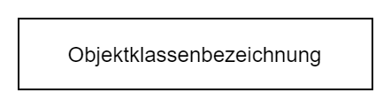
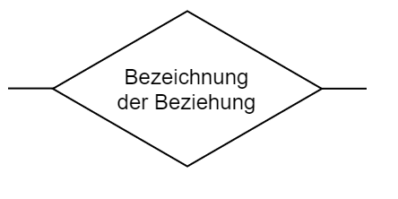
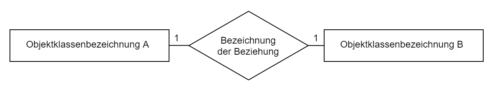
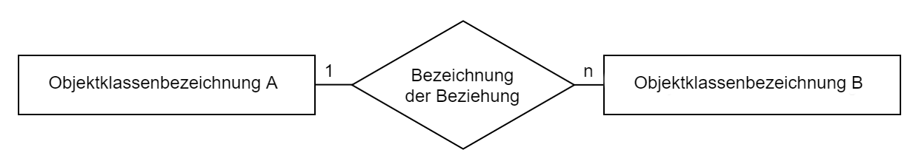
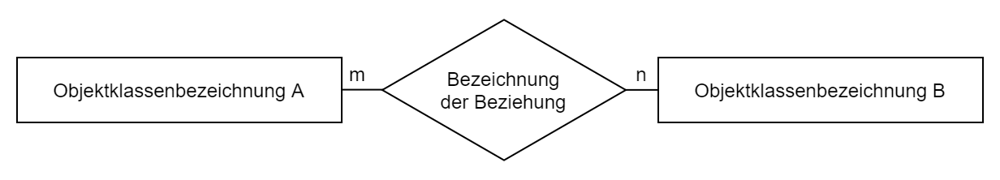
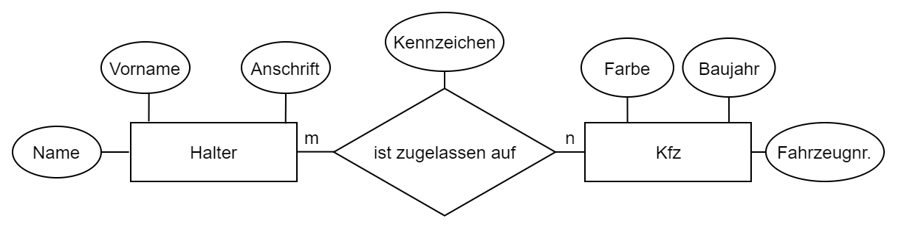

<!----------
title: "Datenbankentwurf"
date: "Semester 4"
keywords: [Datenbankentwurf, Datenbanken, DHGE, Semester 4]
---------->

Datenbankentwurf
================

<!-- START doctoc generated TOC please keep comment here to allow auto update -->
<!-- DON'T EDIT THIS SECTION, INSTEAD RE-RUN doctoc TO UPDATE -->
**Inhaltsverzeichnis**

- [Überblick über den Datenbankentwurfsprozess](#%C3%9Cberblick-%C3%BCber-den-datenbankentwurfsprozess)
  - [Entwicklung von Datenbankschemata](#entwicklung-von-datenbankschemata)
  - [Phasen des Entwurfprozesses](#phasen-des-entwurfprozesses)
  - [Ableitung des Datenbankschemas aus einer verbalen Spezifikation](#ableitung-des-datenbankschemas-aus-einer-verbalen-spezifikation)
- [Logischer Datenbankentwurf](#logischer-datenbankentwurf)
  - [Entity-Relationship-Modell](#entity-relationship-modell)
    - [Komponenten von ERDs](#komponenten-von-erds)
    - [Regeln für die Ableitung eines relationalen Schemas](#regeln-f%C3%BCr-die-ableitung-eines-relationalen-schemas)
  - [Normalformen für relationale Datenbanken](#normalformen-f%C3%BCr-relationale-datenbanken)
    - [1. Normalform](#1-normalform)
    - [2. Normalform](#2-normalform)
    - [3. Normalform](#3-normalform)
    - [Allgemeine Design-Regeln für den Entwurf relationaler Datenbankschemata](#allgemeine-design-regeln-f%C3%BCr-den-entwurf-relationaler-datenbankschemata)
- [Sicherung von Konsistenz und Integrität](#sicherung-von-konsistenz-und-integrit%C3%A4t)
  - [Integritätsbedingungen](#integrit%C3%A4tsbedingungen)
  - [Transaktionen](#transaktionen)
    - [Atomarität](#atomarit%C3%A4t)
      - [Transaktionstypen](#transaktionstypen)
    - [Isolation/Abkapselung](#isolationabkapselung)
    - [Dauerhaftigkeit](#dauerhaftigkeit)
  - [Recovery-Verfahren](#recovery-verfahren)
    - [Aufbau eines Log-Eintrages](#aufbau-eines-log-eintrages)
    - [Typen von Log-Einträgen](#typen-von-log-eintr%C3%A4gen)

<!-- END doctoc generated TOC please keep comment here to allow auto update -->

<!--newpage-->

# Überblick über den Datenbankentwurfsprozess

Der Entwurf einer Datenbank ist ein aufwendiger Prozess, der mit großer Sorgfalt vorgenommen werden sollte, da Fehler später nur mit hohem Aufwand beseitigt werden können.

Folgende Anforderungen sollten daher im Entwurfsprozess berücksichtigt werden:

- **Anwenderorientiertheit:** Beteiligung der Anwender am Entwurfsprozess; Formulierung der Datenmodelle in der Begriffswelt der Anwender
- **Determiniertheit:** genau ein Datenmodell für eine Problemstellung und einen Umweltausschnitt $\rightarrow$ unabhängig von Interpretation
- **Teilbarkeit:** Gesamtschema muss in einzelne Teilschemata aufteilbar sein
- **Integrierbarkeit:** Schemas, die nur einen Teil des Umweltausschnittes darstellen, müssen in das gesamte Schema integriert werden können

## Entwicklung von Datenbankschemata

- Berücksichtigung zweier Entwurfsphasen, bei der Entwicklung datenbankgestützter IT-Lösungen
  - einmaliger Datenbankentwurfsprozess (DEP)
  - n-maliger Softwareentwicklungsprozess (SEP) für Anwendungen, die auf die zentrale DB zugreifen
- der DEP bildet mit Hilfe von Daten- und Beschreibungsmodellen einen Umweltausschnitt (Miniwelt) auf ein Schema ab
- jeder SEP hat meist eigene Sicht auf Datenbank $\rightarrow$ zusammenfassen zu einem konzeptuellen Informationschema
- durch Transformationsregeln kann das konzeptuelle in ein datenbankspezifisches Schema umgewandelt werden

## Phasen des Entwurfprozesses

- Grundvoraussetzung: Anforderungsanalyse (informelle + operationelle/funktionale Analyse)
- Die Nutzung einer Datenbank und die Aktualisierung des Datenbankschemas beschreibt den **Datenbanklebenszyklus**
- Performance-Aspekte spielen untergeordnete Rolle
- Wahrung der logischen Konsistenz der Datenbank hat hohe Bedeutung
- Schemaevolution = Änderungen der logischen Datenorganisation
- Tuning-Maßnahmen = Leistungsverhalten des DBMS verbessern (Anpassung Systemparameter $\rightarrow$ Puffer, gezielte Denormalisierung der Datenbankschemata)

**Datenbankreorganisation** = Maßnahmen, die ...

- in Bezug zum Datenbanksystem stehen,
- den logischen Informationsgehalt der DB nicht ändern und
- üblicherweise zur Verringerung der Speicher- und/oder Verarbeitungskosten beim Betrieb vorhandener Anwendungen dienen.
- z.B.: Änderung interner Struktur der DB, Bereinigung/Neuaufbau interner Speicherungsstrukturen

## Ableitung des Datenbankschemas aus einer verbalen Spezifikation

**Informelle Analyse der Spezifikation**

- Analyse des in der verbalen Spezifikation beschriebenen Umweltausschnittes
- Erkennen einzelner Objektklassen und deren Beziehungen untereinander
- Herausfiltern von für die Modellierung relevanten Informationen
- bei ungenauer Spezifikation Qualität stark von den Fähigkeiten des Datenbank-Designers abhängig $\rightarrow$ Beschaffung fehlender Informationen

**Funktionale Analyse der Spezifikation**

- Spezifikation der funktionalen Anforderungen an das System
- auf welche Art und Weise sind einzelne Objekte zu bearbeiten ($\rightarrow$ Verwendungszweck muss bekannt sein)

**Darstellung der Informationsstruktur mit einem semantischen Datenmodell**

- Ergebnisse der ersten Phase werden zu Modell der Informationsstruktur im Umweltausschnitt zusammengefasst
- standardisierte, vom späteren Datenmodell unabhängige Darstellungsformen
- z.B. *Entity-Relationship-Modell*

**Ableitung eines dem Zieldatenmodell angepassten Informationsschemas**

Ableiten einer Informationsstruktur $\rightarrow$ Abbildung von Objekten und Beziehungen zu Struktur die von einem DBMS verwaltet werden kann

**Physischer Entwurf**

- Anpassung des abgeleiteten Schemas an das konkrekt zu verwendende DBMS und die dazugehörige Datenbasis
- Zuordnung einzelner Attribute zu bestimmten Datentypen
- Festlegung von Integritätsbedingungen und referenziellen Integritäten
- Betrachtung von Forderungen nach Datenschutz und Datensicherheit (u.a. Vergabe von Zugriffsrechten)
- Nach dieser Phase erfolgt die Implementierung der Datenbank auf einem konkreten Rechnersystem

# Logischer Datenbankentwurf

## Entity-Relationship-Modell

- unabhängiges Modell zur Darstellung von Objektklassen und deren Beziehungen
- einfache grafische Darstellung durch Entity-Relationship-Diagramme

### Komponenten von ERDs

**Entities (Objekte/Entitäten)**

<!--width=400px-->

**Relationships (Beziehungen)**

Durch Bezehungen werden die Verbindungen und Abhängigkeiten zwischen den einzelnen Objekten dargestellt.

<!--width=400px-->

Die Beziehungen können unterschiedliche Kardinalitäten besitzen:

<!--width=400px-->

<!--width=400px-->

<!--width=400px-->

**Attribute (Eigenschaten, Merkmale)**

- beschreiben Eigenschaften der einzelner Objekte oder Beziehungen
- aus Gründen der Übersichtlichkeit wird meist in grafischer Darstellung auf Angabe verzichtet

<!--width=400px-->

### Regeln für die Ableitung eines relationalen Schemas

- Für jede im ERD modellierte Objektklasse ist eine Relation zu bilden (Primärschlüssel + alle weiteren Attribute)
- im relationalen Datenmodell werden Beziehungen durch übereinstimmende Werte in Schlüsselfeldern dargestellt
  - Primärschlüssel einer Tabelle wird durch Attribut in anderer Tabelle (Fremdschlüssel) referenziert
  - Objektklassen mit $1:1$-Beziehungen können normalerweise ohne Informationsverluste zu einer Objektklasse zusammengefasst werden (Datenschutz/-verteilung!)
  - bei Objektklassen mit $1:n$-Beziehungen wird der Objektklasse, die mehrfach mit einem Objekt der anderen in Beziehung stehen kann, ein Fremdschlüssel als Attribut hinzugefügt
    - Attribute der Beziehung werden in die Objektklasse mit dem Fremdschlüssel aufgenommen
  - Objektklassen mit $m:n$-Beziehungen werden durch Erzeugen einer neuen Relation abgebildet
    - beinhaltet Fremdschlüssel für beide Objektklassen und Attribute der Beziehung

## Normalformen für relationale Datenbanken

- Ziel: Erkennung von Fehlern bzw. Ungenauigkeiten beim Datenbankentwurf $\rightarrow$ Normalisierung beschreibt Regeln an relationales Schema
  - Beseitigung von Mehrdeutigkeiten und Inkonsistenzen zur Vermeidung von Redundanzen und Anomalien
- Überprüfung der funktionalen Abhängigkeiten von Attributen eines Schemas zum jeweiligen Schlüsselattribut

### 1. Normalform

- die Werte der Attribute sind atomar (zusammengesetzte/kollektionswertige Attribute sind nicht gestattet)
- z.B. Speicherung einer Anschrift: PLZ, Ort, Straße, Hausnr. als separate Attribute $\leftrightarrow$ gesamte Anschrift als ein Attribut
- Listen, Arrays müssen in eigene Relationen ausgelagert werden (wenn DBMS keine entsprechende Erweiterung bietet)

### 2. Normalform

- **Funktionale Abhängigkeit:** Attribut aus einer Menge $A$, kann stets einem Attribut der Menge $B$ zugeordnet werden; Umkehrung muss nicht gelten
  - z.B. Matrikelnummer $\rightarrow$ Name des Studierenden
- **Vollfunktionale Abhängigkeit:** Schlüssel als Kombination aus mehreren Attributen
- Vorliegen der ersten Normalform und
- alle nicht zu den Schlüsselattributen der Relation gehörende Attribute sind nur vom gesamten Primärschlüssel der Relation abhängig
  - Relationen, die keinen zusammengesetzten Primärschlüssel besitzen, entsprechen immer der zweiten Normalform
- bei Verletzung können Einfüge-, Lösch- und Änderungsanomalien auftreten

### 3. Normalform

- Vorliegen der zweiten Normalform + kein Nicht-Schlüsselattribut ist von einem anderen Nicht-Schlüsselattribut funktional abhängig

> Durch Normalisierung entsteht eine sehr große Anzahl an Tabellen $\rightarrow$ hoher Verarbeitungsaufwand durch Join-Operationen.
> Beim Entwurf werden daher in der Regel einzelne Normalformen ignoriert $\rightarrow$ gezielte Denormalisierung (möglich durch Vermeidung von Anomalien, wenn nur lesend zugegriffen wird)

### Allgemeine Design-Regeln für den Entwurf relationaler Datenbankschemata

- jede Tabelle (Relation) sollte intuitiv einem Objekt oder Beziehungstyp entsprechen (aussagekräftige Namen $\rightarrow$ eindeutige Semantik der Relation)
- Entwurf der Basistabellen unter Einhaltung der dritten Normalform $\rightarrow$ keine Anomalien
- Attribute, die NULL-Werte zulassen sollten minimiert werden
- Basistabellen sollten so entworfen werden, dass die Joins über Kombinationen aus Primär- und Sekundärschlüsseln erfolgen

<!--ToDo: Hier fehlen ein paar Inhalte-->

# Sicherung von Konsistenz und Integrität

- **Konsistenz:** Zusammenhang, Beständigkeit $\rightarrow$ widerspruchsfreier Zustand der Datenbank
- **Integrität:** Makellosigkeit, Unbestechlichkeit $\rightarrow$ Wahrung der Konsistenz durch Bedingungen

## Integritätsbedingungen

- Definition von Voraussetzungen, die es dem DBMS ermöglichen bestimmte Fehler zu erkennen
- sind in der Regel Teil des jeweiligen Datenbankschemas
- z.B.: Gehalt > 0, Gehälter der Mitarbeiter < Vorgesetzter, ...
- können konsistenten Zustand oder Übergangsbedingungen beschreiben (z.B. Gehalt darf nur erhöht werden)

**Überlegungen zu Integritätsbedingungen:**

1. Wie werden Integritätsbedingungen formuliert? einfache Bedingungen bei Anlegen des Schemas (`NOT NULL`), komplexere bei der Anwendungsentwicklung
2. Wann werden die Bedingungen geprüft? z.B. bei `UPDATE`-Operationen
3. Wie soll bei Verletzung der Bedingungen reagiert werden? z.B. Ausführung der Operation ablehnen oder selbständige Korrektur durchführen

## Transaktionen

- Ziel: Auswirkungen von intern verursachten Fehlern begrenzen
- eine Transaktion überführt eine Datenbank immer von einem konsistenten Zustand in einen anderen
  - z.B. Banküberweisung besteht aus zwei Teilen: Belastung, Gutschrift $\rightarrow$ es muss sichergestellt werden, dass immer beide durchgeführt werden
- Transaktionen im Sinne von Datenbank-Technologien muss die ACID-Eigenschaften erfüllen
  - **A**tomarität, **K**onsistenz, **I**solation, **D**auerhaftigkeit
- zur Verwaltung von Transaktionen führen DBMS interne Transaktionstabellen

### Atomarität

- eine Transaktion ist immer atomar (unteilbar)
- innerhalb einer Transaktion werden einzelne Datenbankanweisungen sequenziell ausgeführt
- Wenn eine Datenbankanweisung nicht erfolgreich durchgeführt werden kann, müssen alle vorherigen Änderungen der Transaktion rückgängig gemacht werden (Rollback)
- nach einer Transaktion befindet sich die Datenbank wieder in einem konsistenten Zustand
  - Rückgängigmachen unter Verwendung des Transaktionsprotokolls

#### Transaktionstypen

- **Autocommit:** jede einzelne Anweisung ist eine Transaktion
- **Implizite Transaktionen:** wird implizit gestartet, sobald die vorhergehende Transaktion abgeschlossen ist. Jede Transaktion muss explizit mit `COMMIT` oder `ROLLBACK` beendet werden
- **Explizite Transaktionen:** jede Transaktion beginnt explizit mit ``BEGIN TRANSACTION`` und wird explizit mit `COMMIT` oder `ROLLBACK` beendet

### Isolation/Abkapselung

- alle Änderungen, die eine Transaktion bewirkt sollen erst nach Beendigung für andere Transaktionen sichtbar werden
- verhindert, dass gleichzeitig ausgeführte konkurrierende Transaktionen sich gegenseitig beeinflussen
- Umsetzung durch Sperrprotokolle oder Zeitstempelverfahren
- inkonsistente Datenbankzustände werden nicht sichtbar

| Fehlersitutation                  | mögliche Folge                  |
|-----------------------------------|---------------------------------|
| beide greifen nur lesend zu       | keine                           |
| einer lesend und einer schreibend | falsche Ergebnisse (dirty read) |
| beide schreibend                  | inkonsistenter Zustand möglich  |

- Zugriffe auf eine Datenbank müssen synchronisiert werden $\rightarrow$ z.B. durch Sperren von Teilen der Datenbank, auf die eine Transaktion zugreift
- Unterscheidung zwischen Sperren für lesenden oder schreibenden Zugriff
  - bei schreibendem Zugriff: sperren für *alle* anderen Transaktionen (exklusive Sperre)
  - bei lesendem Zugriff: Sperrung nur für schreibende Transaktionen
- mögliche Reaktionen auf Sperrungen: als fehlerhaft abbrechen, auf das Aufheben der Sperre warten oder Sperre ignorieren
  - Verhalten der Transaktion wird mit der jeweiligen Isolationsebene festgelegt
- eine Menge konkurrierender Transaktionen gilt als synchronisiert, wenn das Ergebnis der parallelen Abarbeitung dem der sequenziellen entspricht

### Dauerhaftigkeit

- das Ergebnis einer abgeschlossenen Transaktion gilt als dauerhaft wenn es in der Datenbank erhalten bleibt
- besonders bedeutend nach Systemfehlern
- Verbesserung der Systemleistung durch Datenbankpuffer $\rightarrow$ Pufferverwaltung stellt Daten möglichst effizient zur Verfügung (asynchrone Schreiboperationen auf Datenträger)
  - geänderter Block wird nicht sofort auf den Datenträger geschrieben, verbleibt zunächst im Puffer
  - *Page Cleaner List* dokumentiert beim Schreiben geänderte Blöcke
  - bei Verlust des Pufferinhaltes oder der *Page Cleaner List* (z.B. Stromausfall) können trotz abgeschlossenen Transaktionen Änderungen verloren gehen $\rightarrow$ evtl. inkonsistenter Zustand
  - Überführung in konsistenten Zustand nach Fehlerfall = Recovery/Wiederherstellung
    - Vorwärts-Recovery (*rollforward*): relativ zum Ausgangspunkt des Recoverys in neuen konsistenten Zustand überführen
    - Rückwärts-Recovery (*rollback*): Datenbank wird in einen alten konsistenten Zustand versetzt

## Recovery-Verfahren

- Grundvoraussetzung: Aufzeichnungen über Datenbankinhalte (*physisches Logging*) und den an den Daten vorgenommenen Änderungen (*logisches Logging*) $\rightarrow$ Datenbankprotokoll
- temporäre Protokolle: Sicherung einzelner Arbeitsschritte und Datenbankzustände (meist nur bis zum fehlerfreien Abschluss einer Transaktion; logisch oder physisch)
- dauerhafte Protokolle: Protokollierung über längeren Zeitraum in Log-Dateien (Sicherung zusammen mit Backup der Datenbankinhalte)
  - Gesamtsicherung und Logs ermöglichen Wiederherstellung nach schwerwiegenden Fehlern:
    - Backup der Datenbankinhalte wird zunächst eingespielt (älterer Datenstand) $\rightarrow$ erneute Durchführung der in den Logs aufgezeichneten Operationen (*rollforward*)

### Aufbau eines Log-Eintrages

- Bestandteile fester Länge: *Log Sequence Number*, Transaktionsnummer, Typ des Log-Eintrages, Nummer des geänderten Blocks, Identifikation des betroffenen Datensatzes
- Bestandteile variabler Länge:  Informationen über alten (*Undo Image*) und neuen Inhalt (*Redo Image*) des Teils der Datenbank auf den sich der Eintrag bezieht
- ob Undo- oder Redo-Image protokolliert werden muss, hängt von der Änderungsoperation ab
  - `INSERT`: Redo-Image
  - `UPDATE`: Undo- und Redo-Image
  - `DELETE`: Undo-Image

### Typen von Log-Einträgen

- Transaktionsbeginn, erfolgreiches Beenden einer Transaktion, Abbruch einer Transaktion und Rücksetzen
  - Zuordnung von Log-Sätze zu einzelnen Verarbeitungseinheiten
- Log-Sätze zur Protokollierung von Änderungen
  - beschreiben die Erstellung bzw. Verarbeitung der Datenbankinhalten
- Log-Sätze zur Beschreibung von Sicherungspunkten (Checkpoints)
  - Aufsetzpunkt für Wiederherstellungsoperationen
