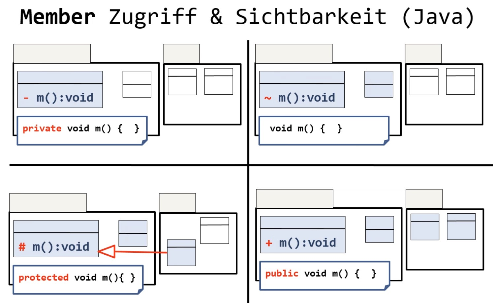

Objektorientierte Programmierung mit Java
=========================================

<!-- START doctoc generated TOC please keep comment here to allow auto update -->
<!-- DON'T EDIT THIS SECTION, INSTEAD RE-RUN doctoc TO UPDATE -->
**Inhaltsverzeichnis**

- [Objektorientierte Programmierung mit Java](#objektorientierte-programmierung-mit-java)
- [Einleitung](#einleitung)
  - [Java-Sprachelemente](#java-sprachelemente)
  - [Methoden](#methoden)
  - [Strings](#strings)
- [Basiskonzepte der OOP & Java](#basiskonzepte-der-oop--java)
  - [Packages](#packages)
  - [Überladen](#überladen)
  - [Konstruktoren](#konstruktoren)
  - [statische Member und Methoden](#statische-member-und-methoden)
  - [innere Klassen](#innere-klassen)
- [Vererbung](#vererbung)
  - [Vererbung vs. Delegation](#vererbung-vs-delegation)
- [Abstrakte Klassen und Methoden](#abstrakte-klassen-und-methoden)
- [Interfaces](#interfaces)
  - [Vererbung vs. abstrakte Klassen vs. Interfaces](#vererbung-vs-abstrakte-klassen-vs-interfaces)
- [Lose Kopplung](#lose-kopplung)

<!-- END doctoc generated TOC please keep comment here to allow auto update -->

# Einleitung

- Bauen eines JARs von einer Klassensammlung: ``jar cmf Manifest.txt name.jar *.class``
  - mit Programm ``jar``
  - Benötigt wird Manifest.txt, welche Version und Hauptklasse enthält
- Java ist eine interpretierbare, objektorientierte Sprache
- Java-Quellcode wird mit ``javac`` in Bytecode kompiliert und mit einer JVM interpretiert

## Java-Sprachelemente

- einzeilige Kommentare am Zeilenende mit ``//``
- Blockkommentar: Start mit ``/*``, Ende mit ``*/``
- Bezeichner **müssen** mit `_`, `$`, oder einem Unicode-Buchstaben beginnen, aber nicht mit einer Ziffer, einem reservierten Wort oder ungültigen Zeichen (???) wie dem `!`
- Bezeichner sind case-sensitiv
- Namenskonventionen:
  - Klassennamen mit großem CamelCase: ``KlassenName``
  - Variablen- und Methoden-Namen mit kleinem camelCase: ``compSumme()``
  - Konstanten in Capslock SNAKE_CASE: ``MAX_SPEED``
- primitive Datentypen sind initialisiert
- Referenzvariablen sind ggf. ``null``
- Literale: Ganzzahlen, Fließkommazahlen, Zeichen, null, Strings, Konstanten
- Im Gegensatz zu C / C++ dürfen in Java Methoden und Membervariablen durcheinander geschrieben werden, ohne Abhängigkeiten zu berücksichtigen. Der Compiler wird diese automatisch sortieren
- Es gibt die Zugriffsmodifier ``private``, ``protected`` und ``public``, wobei **``protected``** der **Standard** ist
- alle primitiven Datentypen existieren auch in Wrapperklassen objektorientiert
- Für zwei Referenzvariablen ``a1`` und ``a2`` kann ausgeführt werden: ``a2 = a1``, wobei die Referenz geändert wird, das Objekt wird nicht kopiert. Entsprechend verweisen beide Variablen auf dasselbe Objekt

## Methoden

Deklaration:

```java
returntyp methodenName(parameterliste) {
    // Methodenkörper
    return something;
}
```

## Strings

- Gleichheit von Strings: Wir betrachten folgenden Code:

``String s1 = "abc", s2 = "abc", s3 = new String("abc");``

  - Java speichert Stringliterale in einem Pool, weshalb ``s1`` und ``s2`` auf dieselbe Adresse verweisen
  - ``s1 == s2`` ergibt ``true``, aber ``s1 == s3`` ``false``
  - **Daher immer ``s1.equals()`` verwenden!**

# Basiskonzepte der OOP & Java

- 4 Grundkonzepte:
  - Abstraktion: Gemeinsame Eigenschaften und Fähigkeiten werden zusammengefasst beschrieben
  - Datenkapselung: Zustandsänderungen nur über dafür vorgesehene Operationen (Methoden)
  - Vererbung: Erweiterung vorhandener Objekte mit zusätzlichen Eigenschaften + Operationen bei bleibender Kompatibilität zum Ursprungstyp
  - Polymorphie: Laufzeitprüfung, wie auf vererbte Objekte reagiert wird
- Klassen und Objekte $\rightarrow$ setze ich mal voraus
- Unterschied Operationen und Methoden:
  - Operation: was wird gemacht?
  - Methode: wie wird gemacht?
- in Java werden keine Prototypen gebraucht
- wer mehrere Klassen in eine ``.java``-Datei packt, kommt in die Hölle

<!--width=600px-->

## Packages

- Verwalten Klassen und Zugriffsrechte
- erste Anweisung **muss** ``package paketname;`` sein
- ohne Zugriffsmodifier an Klasse: nur für eigenes Package sichtbar
- Modifier ``public`` an Klasse: Klasse für alle Packages sichtbar

## Überladen

- in einer Klasse können mehrere Methoden desselben Namens existieren, die aber verschiedene Signaturen haben
- Ein Aspekt der statischen Polymorphie - Methoden haben in Abhängigkeit ihrer Signaturen die gleiche Funktionalität
- siehe auch: C++ (3. Semester)
- **Achtung**: wir sehen den Returntyp hier nicht als Bestandteil der Signatur

## Konstruktoren

- Konstruktoren sind Initialisierer für Objekte und werden von dem ``new``-Operator benutzt
- wird ein impliziter Konstruktor genutzt, werden Membervariablen mit ``null``, ``0`` oder ``false`` gefüllt

## statische Member und Methoden

- existieren nur einmal pro Klasse
- statische Methoden können nicht auf non-statische Methoden zugreifen

## innere Klassen

- innerhalb eines Blockes deklariert und nur dort sichtbar
- haben Zugriff auf Member und Methoden der äußeren Klasse
- Nutzen: Implementierung von Funktionalität, die nur für diese Klasse gültig sein soll / relevant ist
- Anwendung folgt im Kapitel Grafische Oberflächen

# Vererbung

- Schaffung neuer Klassen basierend auf existierenden Klassen
- Beziehung ist dauerhaft
- i.d.R. eine Erweiterung oder Spezialisierung der urspr. Klasse
- erbt alle Member der "Superklasse"
- Java-Syntax: ``class Unterklasse extends Oberklasse {}``
- UML: nicht ausgefüllter Pfeil von Unterklasse zu Oberklasse
- Vorteile:
  - Vermeidung von Quelltextduplizierung
  - einfachere Wartung
  - Erweiterbarkeit von Klassenfunktionalität
- eine überschriebene Methode der Superklasse ist dennoch erreichbar via ``super.methode()``
- finale Klassen können nicht abgeleitet werden
- finale Methoden können nicht überschrieben werden
- Liskovsches Substitutionsprinzip: jede Unterklasse ist auch als ihre Oberklasse verwendbar
- Analog zu C++ kann man ein Array einer Oberklasse auch mit einer Instanz einer Unterklasse befüllen, wobei zur Laufzeit erkannt wird, dass überschriebene Methoden der Unterklassen auszuführen sind
- man darf die Sichtbarkeit von Methoden in Unterklassen erweitern, aber nicht weiter einschränken
- **soll eine Instanz einer Unterklasse niemals auf eine überschriebene Methode der Oberklassse zurückgreifen, muss ``@Override`` über die Methode geschrieben werden**
- Jeder Konstruktor einer abgeleiteten Klasse ruft zuerst den Konstruktor der Superklasse auf
  - implizit, wenn nicht parametrisiert
  - muss explizit aufgerufen werden, wenn parametrisierter Konstruktor
- jede Klasse erbt von ``Object``, auch implizit $\rightarrow$ also hat jede Klasse eine ``toString()``-Methode

Beispiel für Downcasting:

```java
if (m instanceof Arbeiter) System.out.println("\t" + ((Arbeiter)m).getLohnsteuer());
```

## Vererbung vs. Delegation

- Delegation: "Hat ein..." $\rightarrow$ Member-Variable
- Vererbung: "Ist ein..." $\rightarrow$ siehe oben
- Delegation ist der Vererbung vorzuziehen
- Vererbung sollte verwendet werden, wenn...
  - die angestrebte Unterklasse wirklich eine Spezialisierung / ein Teil von der Superklasse ist
  - alle Eigenschaften wirklich vererbt werden sollen

# Abstrakte Klassen und Methoden

- von abstrakten Klassen können keine Objekte erzeugt werden
- werden im Klassendiagramm *kursiv* geschrieben (Vorsicht: sieht man ggf. nicht gleich!)
- abstrakte Methoden können nicht ``private`` sein, weil das keinen Sinn ergibt
- vor abstrakten Methoden, die also keine Implementierung haben, steht das Schlüsselwort ``abstract``

# Interfaces

- auch benannte Schnittstellen genannt
- spezifizieren Menge von Operationen, aber keine Implementierungen $\rightarrow$ abstrakte Methoden
- Definition von Konstanten möglich
- können als Typ verwendet werden, wobei alle Klassen, die dieses Interface implementieren, dafür qualifiziert sind $\rightarrow$ diese Klassen werden **dynamsiche Datentypen** genannt

## Vererbung vs. abstrakte Klassen vs. Interfaces

- Unterklassen, wenn die Oberklasse erweitert werden soll
- abstrakte Klassen, wenn Instanzen der Oberklasse nicht sinnvoll / erwünscht sind
- Interfaces, wenn verschiedene Klassen einen Funktionsumfang implementieren sollen oder gemeinsame Datentypen benötigt werden

# Lose Kopplung

- Szenario: Klasse A nutzt eine Referenzvariable vom Typ ``IB``; mehrere Klassen ``B1``, ``B2``, ... implementieren ``IB``
- Zur Laufzeit kann entschieden werden, welche Klasse genutzt werden soll
