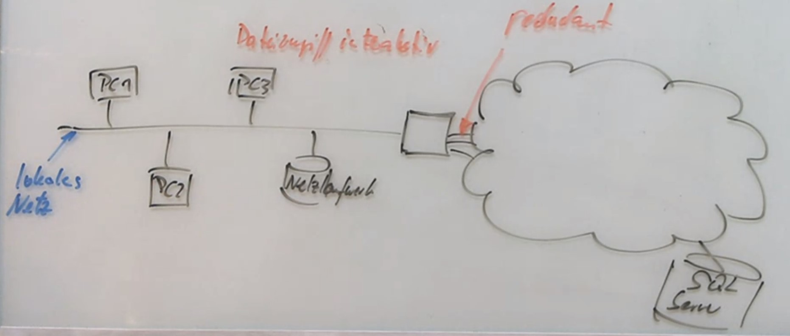

Systementwurf
=============

<!-- START doctoc generated TOC please keep comment here to allow auto update -->
<!-- DON'T EDIT THIS SECTION, INSTEAD RE-RUN doctoc TO UPDATE -->
**Inhaltsverzeichnis**

- [Präambel](#pr%C3%A4ambel)
  - [Entwurf-Herangehensweise (Wiederholung System-Analyse)](#entwurf-herangehensweise-wiederholung-system-analyse)
    - [Kostenschätzungen](#kostensch%C3%A4tzungen)
  - [Entwicklungskonzepte](#entwicklungskonzepte)
- [Entwicklungs-Konzepte](#entwicklungs-konzepte)
  - [Software-Entwurf](#software-entwurf)
  - [Gliederung des Entwurfsprozesses](#gliederung-des-entwurfsprozesses)
  - [Beispiel](#beispiel)
  - [Software Architektur](#software-architektur)
  - [Kriterien für einen guten Entwurf](#kriterien-f%C3%BCr-einen-guten-entwurf)
  - [Software-Architekturen und deren Sichten](#software-architekturen-und-deren-sichten)
    - [Szenarien](#szenarien)
    - [Architektur-Muster für strukturelle Sicht](#architektur-muster-f%C3%BCr-strukturelle-sicht)
    - [Architekturmuster der physikalischen Sicht](#architekturmuster-der-physikalischen-sicht)

<!-- END doctoc generated TOC please keep comment here to allow auto update -->

<!--newpage-->

# Präambel

Qualitäts-Verbesserung durch:

- **Kompetenz der Entwickler**
- **Prozess** (Testen -> *System-Analyse*)
- **Tooling** (Automatisierung, Testen -> *System-Entwurf*)
- **Wiederverwendung** (*System-Entwurf*)

## Entwurf-Herangehensweise (Wiederholung System-Analyse)

- **Phasen (jedes Modells):** Anforderungen, Analyse, Entwurf, Implementierung, Test, Übergabe, Wartung
- Schwergewichtige/klassische Modelle: Wasserfall, V-Modell, V-Modell XT
- Agile Modelle: XP, SCRUM
- MVP: **M**inimal **V**iable **P**roduct
- Story Board

> User Story Format ("Als ... möchte ich ... um ... zu erreichen")
>
> Kommunikation
>
> AGILE: "How to slice a cake"

### Kostenschätzungen

- objektorientierte Sicht (OO-Sicht)
- UML: strukturelle Ansichten, Verhaltensansichten

## Entwicklungskonzepte

> *Was* ist bekannt, wie kommen wir zum *Wie*?

**OO-Entwurf & OO-Komponenten:**

- zeitlicher Verlauf
- Architekturen (bspw. GUI $\rightarrow$ Funktionen $\rightarrow$ Daten, ...)
- Verteildiagramme
- Verhaltensdiagramme
- Entwurfsmuster: MVC, Singleton, Factory, Proxy, Command, Iterator, Interpreter
- Automatisierung
- Datenformate: XML, JSON, CSV
- allg. Begriffe $\rightarrow$ z.B. strukturelle-, physikalische-, Ablauf-, logische Sicht:
- Erfolgsfaktoren
- Grundsatzentscheidungen
- Ziele ... Aufgaben des Entwurfs

# Entwicklungs-Konzepte

## Software-Entwurf

- **WAS:** Anforderung $\rightarrow$ Analyse
- **WIE:** Design, Umsetzung, Test, Auslieferung,  Wartung
- Hauptaufgabe des System-Entwurfs: Zerlegung, Strukturierung, Komponenten in Beziehungen bringen (Voraussetzung: Anforderungen sind benannt)
- Software-Architektur $\rightarrow$ Spezifikation von System-Komponenten
- **Subsystem:** abgeschlossene, eigenständig funktionsfähige Einheit; definiert Schnittstellen; besteht wieder aus Komponenten
- **Komponenten:** Bausteine für Software-System (Pakete $\rightarrow$ mehrere Klassen/Module)
  - benutzt andere Komponenten
  - wird von anderen Komponenten benutzt
  - besteht aus Unterkomponenten

## Gliederung des Entwurfsprozesses

**Grobentwurf** (unabhängig von der Implementierungs-Sprache)

- (1) Architektur-Entwurf
- (2) Subsystem-Entwurf
- (3) Schnittstellen-Entwurf

**Feinentwurf**

- (4) Komponenten
- (5) Datenstrukturen
- (6) Algorithmen

**Ablauf**

- (1) Zunächst wird die Architektur entworfen
- (2) Die Architektur wird in Subsysteme untergliedert
- (3) Die Schnittstellen der Subsysteme werden bestimmt
- (4) Die Subsysteme werden in Komponenten unterteilt
- (5) Die Datenstrukturen und (6) Algorithmen werden definiert

## Beispiel

Entwickeln Sie eine Software-Architektur!

**A**

- Service-Techniker : mobiles Gerät oder Web-Aufruf
- Auftragsschein ausfüllen $\rightarrow$  unterschreiben
- Ziel: DB Ablage

**B**

- aus Reihe von Dienstleistungen aussuchen können
- vor Ort Grobpreis-Aussage machen können
- ggf. Angebotserstellung beauftragen

> Grundlegendes Vorgehen: Zerlegung, Strukturierung, Beziehungen bilden
>
> Wichtig: Für WEN wird die Architektur entwickelt (dargestellt)? (einen User interessieren andere Dinge als einen Entwickler)

- Ist die Ausführung korrekt, vollständig und präzise?
- Gruppierung $\rightarrow$ (Zusammengehörigkeit)
- ausreichende Trennung?

## Software Architektur

> beschreibt die grundlegende Organisation des Systems

- verkörpert durch seine Komponenten, seine Beziehungen zur Umgebung und seine Komponenten-Beziehungen
- verwendet werden Diagramme für verschiedene Sichten

beruht auf:

- allgemeinen Entwicklungs-Prinzipien
- Heuristiken
- Architektur-Muster ("Kostproben von Möglichkeiten")

$\rightarrow$ Dokumentation wird erzeugt

**Szenarien (Sichten):**

- Strukturelle Sicht $\rightarrow$ Physische Sicht
- Ablaufsicht
- Logische Sicht ("Nutzer-Sicht")

> Die Sichten generell nicht mischen! Sichten für die jeweiligen Zielgruppen einzeln erstellen. Es gibt jedoch auch Ausnahmen.

## Kriterien für einen guten Entwurf

<!-- markdownlint-disable list-indent -->

- (1.) Verständlichkeit und Präzision
  - dem Leser "muss ein Licht aufgehen"
  - kann durch einen Review-Prozess gewährleistet werden (2. Namen draufschreiben)
- (2.) Anpassbarkeit/Erweiterbarkeit
  - Trennung in Module
  - elektronische Variante (auf Papier zwar auch möglich aber generell weniger empfehlenswert)
- (3.) Korrektheit
  - Sind die Anforderungen erfüllt?
  - Existieren alle Funktionen des System-Modells?
  - Checkliste, ...
- (4.) hohe Kohäsion
  - Maß für Zusammengehörigkeit
  - Früher: ähnliche Funktionen zusammenfassen
  - Heute: Objekt-Orientierung
    - Paketbildung
    - geeignete Muster (später)
    - kohärente Klassen (es existiert keine Partitionierung in Untergruppen von Attributen bzw. Methoden)
- (5.) Schwache Kopplung
  - Maß für die Abhängigkeit zwischen Komponenten
  - Arten der Kopplungen:
    - (1.) Daten-Kopplung (gemeinsame Daten) ($\rightarrow$ Microservices, Objektorientierte Kapselung)
    - (2.) Schnittstellen-Kopplung (gemeinsame Aufrufe) ($\rightarrow$ OK wegen höherer Flexibilität)
    - (3.) Struktur-Kopplung (gemeinsame Strukturelemente) ($\rightarrow$ keine Vererbung über Paketgrenzen hinweg)
  - $\rightarrow$ möglichst gering, weil dadurch die Wartbarkeit und Stabilität erhöht wird
  - Änderungen wirken nur lokal
  - Performance kann jedoch darunter leiden
  - `private`, `public` $\Rightarrow$ `getter`/`setter` $\rightarrow$ als Maß für die Kapselung
- (6.) Wiederverwendbarkeit
  - Maß für Ausnutzung von Gemeinsamkeiten
  - Verringerung der Redundanz
  - Erhöhung der Stabilität (Fehler existieren nur an einer Stelle)
  - Hilfsmittel: IDEs warnen, OOP $\rightarrow$ Vererbung, Parametrisierung (Prozedurale Programmierung), Module/Objekte mit allgemeiner Schnittstelle

<!-- markdownlint-enable list-indent -->

## Software-Architekturen und deren Sichten

**"4+1 Sichten" (Szenarien)**

- Strukturelle Sicht $\rightarrow$ Blick vom Entwickler
  - Softwaremodule, Bibliotheken, Schnittstellen
- Physische Sicht $\rightarrow$ Service-Mitarbeiter
  - PCs, Netze, Eingebettete Systeme
- Ablauf-Sicht $\rightarrow$ Integrator
  - Prozesse, Threads, Synchronisation
- Logische Sicht $\rightarrow$ Benutzer

> Grob-Entwurf: Strukturelle Sicht, mit teilen der physischen Sicht
> Fein-Entwurf: Rest der physischen Sicht, Ablauf-Sicht und Logische Sicht

### Szenarien

<!-- markdownlint-disable indentation -->

- Verbindung zwischen Sichten
- zeigen Laufzeitverhalten
- keine extra-Sicht ("4+1")
- Kriterium für Architektur-Bewertungen
  - welche Architektur-Muster scheinen besser zu sein?
- Qualitätssicherungswerkzeug (Review)
  - **direkte** Szenarien: auf der Architektur gut realisierbar
  - **indirekte** Szenarien: erst nach Erweiterung realisierbar
- Bewertung mittels:
  - (1.) Anzahl direkte Szenarien
  - (2.) Aufwand für Modifikationen (um bisher indirekte Szenarien in direkte zu überführen)

<!-- markdownlint-enable indentation -->

$\rightarrow$ Abschätzung der Effizienz

### Architektur-Muster für strukturelle Sicht

- Zerlegung in eigenständige Funktionalitäten
- *keine* Aussage über ihre physische Verteilung
- Blockdiagramme (kein UML-Bestandteil)
- Komponentendiagramm (im UML)

> An dieser Stelle kam eine Erklärung, wie ein Komponentendiagramm aussieht.
> Hier eine externe Übersicht: [Klick](https://www.uml-diagrams.org/component-diagrams.html)
> Hier sind die Pfeile und Symbole nochmal besser erklärt: [Klick](https://www.visual-paradigm.com/guide/uml-unified-modeling-language/what-is-component-diagram/)

- **Kette**
  - (1.) Abfolge von Transformationen von Eingabedaten
  - (2.) Pipes, Filter
    - Daten werden nicht im Block transformiert, sondern inkrementell
    - $\rightarrow$ Pipes sind zustandslos
    - Filter arbeiten nach Pull-Prinzip
    - Unterschied mit @UML nicht darstellbar
  - (3.) gut wiederverwendbar
- **Repository**
  - Lager, Depot
  - digitales Archiv
  - häufig inklusive Funktion zur Versionsverwaltung
  - Datenzentrierung
  - Daten sind passiv
  - Vorteil: Klienten sind unabhängig $\rightarrow$ einzeln änderbar
  - Bsp.: SVN, CVS, GIT, Mercurial; integrierte Entwicklungs-Umgebung; Management-Informations-Systeme
- **Schichten**
  - Benutzer greift auf eine Schicht zu
  - jede Schicht bietet Dienst nach oben an und nutzt einen Dienst von unten
  - Bsp. ISO/OSI Referenz Modell, TCP IP-Stack
- **Die 3-Schichten Architektur**
  1. Präsentations-Schicht (z.B. GUI)
  2. Logik-Schicht (z.B. Algorithmen)
  3. Datenhaltung-Schicht (z.B. Datenbank)
  - Mindestmaß für architektonische Strukturierung
- **Interpreter**
  - Programm läuft auf einer abstrakten Maschine; Benutzer interagiert mit der abstrakten Maschine
  - Interpreter parst Programm \rightarrow\rightarrow lässt es auf Basis-System laufen
  - Bsp.: C-Python, Java (JVM), Javascript, Bash
  - Vorteil: keine Hardwarebinding, (Optimierung zur Laufzeit)
  - Nachteil: beschränkte Optimiermöglichkeiten; Zusatzaufwand für die abstrakte Maschine; keine Spezialisierung für die Hardware möglich; Schreibschutz von Programm-Daten nicht möglich ("NX-Bit")

**Vorteile eines Musters**

<!-- markdownlint-disable -->

1. Dinge sichtbar gemacht
   - Dokumentation
   - Kommunikation fördert
   - Verständnis wird erleichtert
2. Wiedervewendung auf Entwurfsebene
3. generische Lösung für ein Problem
4. **nichtfunktionale Anforderungen *können* sichtbar werden**
5. Wissen über gute Entwurfspraktiken wird gekapselt
6. Corporate Identity

<!-- markdownlint-enable -->

### Architekturmuster der physikalischen Sicht

- Aufteilung der Funktionalitäten auf Knoten eines Netzes
- Darstellung mittels Konfigurations-Diagramme
- Darstellung: (im Rechteck) Knoten; (am Pfeil) Kommunikation
- Zentrales System, Client-Server, Föderation, Konfigurations-Diagramm

**Zum Zentralen System**

- klassischer Großrechner
- keine Intelligenz bei Terminals
- Terminal 1, Terminal 2, Terminal 3 ... Termanal N $\rightarrow$ greifen alle auf das zentrale System zu

**Zum Client-Server**

- viele intelligente Clients (Frontend) greifen alle auf einen Server (Backend) zu

Frontend:

1. User-Interface
2. Einbindung in die Geschäftsprozesse

Backend:

1. Datenhaltung
2. Fachlogik
3. ggf. Weiterleitung

THIN Client

- nicht eigenständig ("Screen Scraping")
- nur User-Interface
- Network-Computing (ohne Server sind keine Aktionen möglich)
- Kosten geringer aber Anforderung an die Infrastruktur ist höher

FAT Client

- Teile der Anwendungslogik auf dem Client
- Server Entlastung
- Datenhaltung auf Server
- bedingt eigenfähig überlebensfähig

>Übungs-Aufgabe:
>1. FAT-Clients (Multithreading)
>2. Datenserver
>3. MPI (Message Parsing Interface) soll möglich sein (wahlweise)
>4. Cloud Computing

Mit Plantuml darstellen!

**Zum Three Tier Client/Server**

- viele intelligente Clients (UI, Fachlogik) kommunizieren mit Anwendungsserver (weitere Fachlogik, Verteilung der Anfragen auf verschiedene Server)

**Zum Verteilmuster Förderation**

- gleichberechtigte Partner
- verteilte Subsysteme, die miteinander kommunizieren
- (als voll-vermaschtes Netz dargestellt)

>Übungs-Aufgabe 2:
>- verschiedene Simulationsprogramme
>- verschiedene CAD-Programme
>- Schwing-Simulation, Thermo-Simulation
>- Calculationssimulationsprogramm
>- Produktionssimulation
>- Montage
>- Beschichtung
>
> insgesamt 13 verschiedene Programme
>
> Frage: Systementwurf um diesen Produkt-Entstehungsprozess zu unterstützen
>
> Anzahl an Konvertern bestimmen
>
> *???*

**Zum Konfigurations-Diagramm**

- System-Komponenten können gut dargestellt werden
- nicht im UML offiziell beschrieben

<!--width=600px-->

**MPI**

- Prozess auf einer anderen Maschine starten
- Daten für die Ausführung (und Ergebnis) über standardisiertes Protokoll zwischen Maschinen übertragen