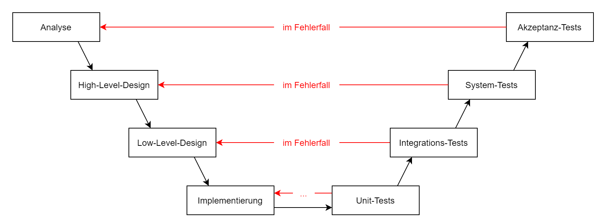

# Lernkontrollfragen

## System-Analyse

### Einleitung / Überblick

#### SW-Engineering definieren

> Zielorientierte Bereitstellung und systematische Verwendung von Prinzipien, Methoden und Werkzeugen
> für die arbeitsteilige, ingenieurmäßige Entwicklung und Anwendung von umfangreichen Softwaresystemen.
> Zielorientiert bedeutet die Berücksichtigung z.B. von Kosten, Zeit und Qualität.
>
> - [Helmut Balzert: Lehrbuch der Software-Technik](https://www.doi.org/10.1007/978-3-8274-2247-7)

#### Phasen der SW-Entwicklung unabhängig vom verwendetet Modell benennen

- Anforderungen (Anforderungsanalyse)
- Strukturierung der Entwicklung
- Entwurf und Entwicklung der Lösung
- Betrieb und Wartung der Lösung
- Qualitätssicherung (Testen)

#### Unterschied zwischen SW-Entw.-Phasen und –Modell benennen

- ToDo

#### ein Beispiel für ein MVP nennen

- **MVP** = **M**inimum **V**iable **P**roduct (minimales überlebensfähiges Produkt)
- Testen eines Produktes mit möglichst wenig Entwicklungsaufwand
- Amazon: verkaufte anfangs nur Bücher, später Expansion in andere Produktkategorien
- Groupon: Launch mit einfachem Wordpress-Blog vor der Entwicklung einer eigenen Plattform
- Airbnb: zunächst nur einfache Website Vermietung der Wohnung der Gründer, danach Öffnung für andere Gastgeber

#### das MMM-Prinzip erläutern

- **MMM** = **M**ensch, **M**aschine, **M**ethode
- Zuerst schauen: *"Habe ich die richtigen Mitarbeiter?"*
- Danach prüfen: *"Habe ich die richtige Hardware/Software?"*
- Zuletzt hinterfragen: *"Verwende ich die richtigen die Methoden?"*

#### Regeln der SW-Entwicklung benennen

**1. Klartext reden**

- Linear:
  - Was möchte der Kunde bekommen?)
  -	Pflichtenheft (Was hat der Entwickler verstanden, was macht er?)
- Agil:
  -	feste Struktur & klare Regeln → jedoch adaptierbar
  -	Backlog → Aufgabensammlung
  -	Refinement Prozess!

**2.	Gründliche Vertragsgestaltung**

- Wasserfallmodell
  - 1/2 Jahr rechtsichere Fomulierung des Lastenhefts
  -	gleiche Begriffe zu Beginn des Lastenhefts abklären
  -	dritte Person ließt, versteht und korrigiert → unterschreibt
- Agil:
  - Backlog + Refinement

**3.	Wandelnde Anforderungen: Wie gehe ich damit um?**

- Zum Beispiel: keine Zusatzleistungen bzw. E-Mail/mündlich => am Ende: was zählt?
-	Change Request Prozess:
-	Request → Impact, Analysis → Approve / Deny → Implementation → Business
-	14 Tage Cycle: Planning, Review, Retro

#### DOD und DOR erklären und deren Bedeutung benennen

- Checklisten
- Immer anhand einfach zu bestimmender Metriken definieren.
- Definition of Ready (allgemein): Was sollte erledigt sein, damit eine Aufgabe begonnen werden kann? Konkret / allgemein
- Definition of Ready (SCRUM): Liste von Kriterien, die Backlog Items erfüllen müssen, bevor sie in Sprint eingeplant werden.
  - Beispiel:
  - Item im Product Backlog
    - ist klein genug für Sprint
    - ist verständlich
    - hat Aktzeptanzkriterien
    - ...

- Definition of Done: Wann ist die Aufgabe/Projekt erledigt?
  - Beispiel:
  - Der Code ist fertiggestellt und im Versionierungssystem eingespielt.
  - Es gab einen Code Review bzw. der Code wurde im Pair Programming erarbeitet.
  - Es gibt entsprechende Unit Tests und diese stehen auf grün.
  - Alle Akzeptanzkriterien sind erfüllt.
  - ...

Quellen:
[DOR 1](https://www.scrum-events.de/was-ist-die-definition-of-ready-dor.html)
[DOR 2](https://t2informatik.de/wissen-kompakt/definition-of-ready/)
[DOD](https://www.scrum-events.de/was-ist-die-definition-of-done-dod.html)

#### die äußere Form einer User-Story benennen

> Als ... möchte ich ... um ...

- Erklärung eines Features aus Sicht einer Person, die das Feature verwenden will

### Retrospektive

#### benennen, wozu eine Retro gut ist

- ausschließliche Betrachtung des Prozesses

#### erläutern, welche Vorteile eine regelmäßige Retro hat

- Verbesserung der Zusammenarbeit im Team
- Verbesserung der Arbeit des Teams
- Aufgestauten Frust vermeiden
- Raum geben, um Probleme im Team offen anzusprechen
- Maßnahmen zur Optimierung des Zusammenhalts im Team entwickeln

[Quelle: T3N](https://t3n.de/news/scrum-was-ist-eine-retrospektive-1129292/)

#### sagen, wer die Retro im Scrum-Prozess leitet

- die Retrospektive wird durch den Scrum Master geleitet

#### die Elemente eine Retro-Veranstaltung aufzählen

- Intro: Begrüßung, über Ziele der Retrospektive abstimmen
- Daten sammeln: Was ist gut und was schlecht verlaufen? Analyse und Priorisierung einzelner Themen
- Einsichten gewinnen: Teilnehmer erörtern Erfahrungen; Ermittlung von Ursachen für Erfolge und Misserfolge
- Maßnahmen beschließen: Konstruktion konkreter Maßnahmen, die zu Veränderungen führen sollen
- Abschluss: Rückblick auf die Retrospektive; Verbesserungsvorschläge für zukünftige Retrospektiven sammeln

[Quelle: T3N](https://t3n.de/news/scrum-was-ist-eine-retrospektive-1129292/)

#### darstellen, was und wieviel nach dem Clustern der Impediments erzeugt werden muss

- ToDo

#### die empfohlene Häufigkeit einer Retro beim Scrum und bei anderen Vorgehensmodellen jeweils erläutern

- SCRUM-Vorgabe: Am  Ende des Sprints 
- Bei kurzen Sprints (z.B. 1 Wochen) ist es sinnvoll, davon abzuweichen. Retro dann erst nach mehreren Sprints.
- [t2informatik](https://t2informatik.de/wissen-kompakt/scrum-retrospektive/), Scrum Guide empfiehlt 3h / Monat Retro
- Bei 2 Wochen Sprint also z.B. 2 x 1,5 h
- Bei 1 Wochen Sprint das gleiche, Retro nach jedem zweiten Sprint

- Andere Modelle: vielleicht nach jedem Projekt, wenn überhaupt (ToDo)

### Phasenmodelle

#### die fünf Phasen des Wasserfall‐Modells benennen und erläutern

- **Analyse:** Funktionsumfang, User Interface, Leistungsverhalten, Termine klären (Lastenheft als Grundlage)
- **Design:** Festlegen der innere Struktur der Software $\rightarrow$ Komponentenzerlegung; Erstellung des Pflichtenhefts
- **Programmierung:** Komponenten (Module) werden anhand des Entwurfs implementiert
- **Integration / Test:** Zusammenfügen einzelner Komponenten (Integrationstest); nach Zusammenfügen Systemtest (Konsistenz bezüglich der Produkt-Definition prüfen)
- **Einsatz / Wartung:** Fehlerkorrektur, Änderungen und Erweiterungen der Funktionalitäten und Anpassungen an andere System-Umgebungen bis zum Abschalten der Software

#### das Wasserfall‐Modell hinsichtlich Vor‐ und Nachteilen evaluieren

**Vorteile**

- Gesamtkosten und Aufwand zu Beginn klar
- Einzelabschnitte sind wenig komplex
- Phasenpipelining möglich

**Nachteile**

- wenig Flexibilität bezüglich Änderungsmöglichkeiten
- Testen nur am Ende
- für komplexe Aufgaben oder große Teams ungeeignet
- Kunde wird kaum involviert
- kein experimentelles Vorgehen
- Fail Early wird nicht unterstützt

#### eine Weiterentwicklung des Wasserfall‐Modells zum iterierte Phasenmodell motivieren

- Iteriertes Phasenmodell: Phase kann bei Problemen wieder zurückgesprungen werden
- PDCA-Prinzip: **P**lan, **D**o, **C**heck, **A**ct, *(zurück zu Plan)*
  - kurze Planungszeit, schnell in das *Do* übergehen und nach kurzer Zeit prüfen

#### einen Prototyp vom Pretotype unterscheiden

- Pretotype = *"fake it till you make it"*
  - Teil der Fail-Early Idee $\rightarrow$ es wird so getan, als wäre eine Funktion vorhanden (keine tatsächliche Implementation)
  - Ziel: Bedarf einer Lösung, Art und Weise der Nutzung und Erfolgskriterien für ein Produkt benennen
  - z.B. Simulation der Interaktion in einer App über mehrere Papierskizzen mit grobem Interface der verschiedenen Screens
- Prototyp
  - **funktionsfähiges, vereinfachtes Versuchsmodell** eines geplanten Produktes
  - sammeln praktischer Erfahrungen, klären von Anforderungen
  - Ziel: Funktioniert es wie gedacht? Kann ich es überhaupt entwickeln?
  - Gefahr: wird nicht wieder weggeworfen, als Doku-Ersatz missbraucht oder Aufwand zu hoch

#### fünf Grundprinzipien nennen, die den Design‐Thinking‐Prozess befördern und kenne die vier Phasen des Design‐Thinking‐Prinzips

- = Methode für den Innovationsprozess
- **Idee:** Iterationen, Prozesse und Objekte bewusst gestalten, die sich streng an den Bedürfnissen des zukünftigen Nutzers orientieren
- **Grundprinzipien:**
  - bildlich Arbeiten
  - früh und oft scheitern (*fail early!*)
  - Quantität ist wichtig: viele Herangensweisen sammeln, aber nicht in die Tiefe verfolgen
  - wilde Ideen zulassen und ermutigen
  - insgesamt kundenorientiert
- **Phasen:**
  - **Inspiration:** Verstehen und Beobachten $\rightarrow$ Was soll für wen entwickelt werden?
  - **Ideen:** *verknüpfen, sprudeln lassen*
  - **Testen:** Pretotyp, Prototyp, ...
  - **Machen:** *nicht nur reden*

### Spiralen-Modell, V-Modell, XP

#### die Quadranten des Spiralen-Modells

- **Ziele**, Alternativen und Rahmenbedingungen
- **Risiken** abschätzen und reduzieren, Evaluierung der Alternativen
- **Realisierung** und Überprüfung
- **Plan** für den nächsten Zyklus
- Annäherung an Gesamt-Ziel durch zyklische Wiederholung der vier Phasen
- Weiterentwicklung des Wasserfallmodells; versucht auf sich ändernde Ziele während des Projektfortschrittes zu reagieren

#### den Entwicklungsablauf beim Spiralen-Modell

| Zyklus | Phase 1                                | Phase 2                            | Phase 3                                 | Phase 4          |
|--------|----------------------------------------|------------------------------------|-----------------------------------------|------------------|
| 1      | Planung                                | Risiko, Prototyp 1                 | Anforderungen                           | Entwicklungsplan |
| 2      | Ziele, Alternativen, Rahmenbedingungen | Risiko, Prototyp 2                 | Grob-Entwurf                            | Testplan         |
| 3      | Ziele, Alternativen, Rahmenbedingungen | Risiko, Prototyp 3 (betriebsfähig) | Fein-Entwurf, Code, Integrieren, Testen | ...              |

#### Zielkriterien, warum überhaupt Entwicklungsmodelle verwendet werden

- ToDo

#### das allgemeine V-Modell und dessen Vorteile gegenüber anderen Phasen-Modellen

- 

| Vorteile                                              | Nachteile                                                                                                         |
| ----------------------------------------------------- | ----------------------------------------------------------------------------------------------------------------- |
| klarer Ablauf (nächster Schritt bei Fehler wird klar) | Fehler in der Anaylse-Phase erst sehr spät sichtbar (früher mehr Kommunikation mit dem Kunden und MVP als Lösung) |
| klare Test-Struktur vorgegeben                        |                                                                                                                   |
| Iterationen bis alle Tests der Phase OK sind          |                                                                                                                   |

- ToDo

#### die Bedeutung des XT beim V-Modell-XT

- XT-> Extreme Tailoring 
- an Bedürfnisse anpassbar
- Auftraggeber mit eingebunden
- stärkere Modularisierung
- mehr in Richtung AGIL

#### die Bausteine des V-Modell-XT, die vier Projekt-Typen und einige Durchführungs-Strategien
- Bausteine
- ToDo

-4 Projekt-Typen:
  1. Auftraggeber Projekt (AG): Vergabe von Entwicklungsaufträgen
  2. Auftragnehmer Projekt (AW): Entwicklung
  3. AG/AW: ohne Vertragsverhältnis (z.B. Fach + Developer Abteilung sitzen zusammen)
  4. Organisationsspezifische Projekt

Durchführungs-Strategien:
	-ToDo

#### die 3 Säulen, deren sich das V-Modell-XT bedient

- 3 Säulen: Meta-Modell, freie Inhalte, Werkzeuge
**Meta-Modell**
- Rollen
- Produkte
- Beziehungen (Aktivitäten)

feste Inhalte + optionale Bestandteile

Produkt-orientierte Arbeitsweise + Tailoring

Auftrag-Geber / Auftrag-Nehmer im Sprachgebrauch + Schnittstellen (Synchronisations-Punkte)

**Werkzeuge**
- V-Modell XT-Editor (für Anpassungen)
- V-Modell XT-Projekt-Assistenten (Tailoring)
- XML-Technologie baiserend

|                     |                                                                                |
| ------------------- | ------------------------------------------------------------------------------ |
| produktorierentiert | nicht *wie*, sondern *was* "hergestellt" wird                                  |
| Produkte            | Software-Code, Modelle, Dokumentationen, Zwischenergebnisse (auch als SW-Code) |

für alle Produkte gibt es sog. Entscheidungspunkte (Milestones)
- inklusive Aussagen zur Qualitätskontrolle
- DoD

> DoR: "Definition of Ready"  
> DoD: "Definition of Done"

#### den Grund für den Buchstaben X beim Extrem Programming und kann mindestens drei von den vier Techniken erläutern

> XP setzt bewährte Techniken im extremen Maße ein
E**X**TREME
1. Paar-Programmierung  
   kontinuierliches Review
2. Testen  
   kontinuierliches Testen
3. Refactoring  
   kontinuierliches Design / Redesign
4. Feedback an Kunden  
   kurze Release Zyklen

#### mindestens eine übernehmenswerte Technik aus dem XP für andere Vorgehensweisen

- ToDo
Alle, LOL
kontinuierliches Testen ist essenziel!

### SCRUM

#### Vier Phasen einer empirischen Prozess-Kontrolle benennen und die Vorteile darstellen

- Plan
- Do
- Check
- Act (zurück zu Plan)

- kurze Planungszeit, schnell in das Doing übergehen und nach kurzer Zeit prüfen  
- soll zu einer besseren Lösung führen
- transparenter Prozess
- Doing + Überprüfung + Anpassung
- häufige Wiederholung

#### den SCRUM-Ablauf beschreiben

<!--- kollidiert inhaltlich mit "Einzelnen Events aufzählen, bzw kann ich (Jonathan) die Fragen nicht wirklich unterscheiden --->
- 1. Vision $\rightarrow$ Produktbacklog: im Produktbacklog ist die oberste Aufgabe die Wichtigste
- 2.	Sprint-Planning: Team erstellt ein Sprint-Backlog aus dem Produkt-Backlog (Definition eines Sprint-Ziels)
- 3.	Bearbeitung des Sprints (meist 14 Tage)
  -	Daily Meeting (jeder im Team erzählt ganz kurz, woran er gerade arbeitet)
  -	am Ende des Sprints: Sprint Review (bezieht sich konkret auf den Inhalt des Sprints)
  -	Retrospektive (bezieht sich auf den Prozess des Sprints, realisierbar durch KSSP) $\rightarrow$ zurück zu 2.
- Die 4 festen Events sind nicht abwählbar 
aber Aussage
>Bei SCRUM kann vieles an Bedürfnisse vom Team angepasst werden

#### die Rollen und deren Aufgaben im SCRUM-Prozess benennen

- **Product Owner**
- **SCRUM Master**
- **Team**

**Product Owner**
- muss eine "Brücke" zwischen Business und Development herstellen
- muss ROI (Return of Investment) gewährleisten
- ist die Schnittstelle zum Kunden $\rightarrow$ muss die Kundenbedürfnisse verstehen und einordnen
- **Value:** muss Kriterien für den Value definieren und ihn erhöhen $\rightarrow$ Was und Warum?
- ist für Sprint Reviews verantwortlich
- muss Backlog Prioritäten setzen

- **Aus praktischer Erfahrung ist der PO:**

  - ein Full-Time Job  
  - eine Authoritätsperson  
  - genau eine Person

**Entwickler-Team**

- besteht idealerweise aus 7+-2 Mitarbeiter
- selbstorganisierend
- Mitarbeiter ist typischerweise "I-shaped" $\rightarrow$ hat auf einem Gebiet extrem tiefes Wissen 
- das Ziel ist jedoch ein "T-shaped" Mitarbeiter $\rightarrow$ hat ein breites Wissen, mit einem Spezialbereich
- sind Macher
- sind nach außen geschützt

**SCRUM-Master**

- Kümmerer (kümmert sich um Probleme seiner Mitarbeiter)
- Diener + Führer in einer Person
- Prozessbeobachter
- dokumentiert u.A. den Fortschritt der Entwicklung
- hilft dem Team, Probleme zu lösen
- idealerweise ist der SCRUM-Master ein fachfremder Mitarbeiter

#### die einzelnen Events des SCRUM aufzählen und kenne Ziel sowie personelle Zusammensetzung eines jeden Events

- ToDo
<!--> Ziel und Erklärung ist auszuweiten <--->

-	Sprint Planning (Alle)
- Daily Scrum (Dev-Team, gelegentlich SCRUM Master, nicht PO)
- Retro (Alle)
- Sprint Review (Alle + wechselnde Stakeholder)

[guckst du hier](https://agility.im/frequent-agile-question/who-attends-what-event-in-scrum/)

#### die Zielrichtung für das Pflegen einer Pairing-Tabelle darstellen

- ToDo : kürzen
**Pairing-Tabelle** als Werkzeug:  
Ziel: eine realistische Aufteilung der Themen auf die Mitarbeiter  
- Realisierung durch eine einfache (Excel) Tabelle  
- es wird schnell klar, ob Mitarbeiter zu wenige oder zu viele Themen bearbeiten sollen
- die Machbarkeit des Sprints wird frühzeitig sichtbar

- pro Zeile ein Thema
- Anzahl der Themen soll ca Anzahl Mitarbeiter / 2
- Spalten den Mitarbeitern zuordnen
- Verantwortliche (zu den Themen) zuordnen
- pro Mitarbeiter habe ich Informationen: Zu viele Verantwortlichkeiten? Zu viele Themen?
- pro Zeile: Informationen, wie viele Mitarbeiter im Thema involviert sind
- **ZIEL:** Probleme frühzeitig sichtbar machen! (und im Idealfall lösen)

> Die Anzahl der Zeilen (Themen) ist künstlich beschränkt! (da T-shaped Mitarbeiter --> die Mitarbeiter sollen voneinander lernen können)

#### sagen, warum DOR und DOD verwendet werden sollten

- ToDo

#### aus Checklisten herausfinden, welche Punkte nicht in eine DOR bzw. DOD kommen sollten

- ToDo
- Kommt aus der Übung.. leicht messbar muss es sein!
- Gesamten Prozess sichtbar machen

#### Checklisten den einzelnen Typen (DOR, DOD) zuordnen und ggf. wichtige fehlende Punkte ergänzen

- ToDo
- Auch eine Übungssache ..?

#### das SCRUM-Manifest und dessen Anwendung erläutern

- ToDo

#### ein Kanban-Board für eine Aufgabe erstellen und kenne die Bedeutung eines Kanban-Boardes für die SW-Entwicklung sowie für Bereiche außerhalb der Informatik

- ToDo

#### ein STORY-Board für eine SW-Entwicklungs-Aufgabe erstellen und den Vorteil der Verwendung motivieren

- ToDo

### Aufwandsschätzungen

#### Scrum-Poker in seiner Art erläutern sowie Vor- und Nachteile auflisten

- ToDo

#### die drei wesentlichen Säulen von Scrum-Poker ähnlichen Schätzverfahren benennen und begründen, warum ein neues Verfahren, welches ich mir ausdenken würde, genau diese drei Aspekte beheimaten sollte

- ToDo

#### Monatsaufgaben eines SW-Entwicklers benennen

- ToDo

#### das Teufelsquadrat zur Argumentation verwenden und weiß, wann ich es einsetzen kann

- ToDo

#### Faktoren benennen, die Aufwandschätzungen beeinflussen

- ToDo

#### empirische Schätzverfahren benennen und deren Ablauf-Restriktionen darstellen

- ToDo

#### Delphi-Methode mit Scrum-Poker vergleichen

- ToDo

#### algorithmische Schätzverfahren benennen und kenne die Struktur der Berechnungsformeln

- ToDo

#### Schwachstellendes CoCoMo bzw. Function-Point-Methode darlegen

- ToDo

## System-Entwurf

### Entwicklungskonzepte

#### Hauptaufgaben des Systeme-Entwurfs benennen

- ToDo

#### Themen für zu treffende Grundsatzentscheidungen beim System-Entwurf benennen

- ToDo

#### den Ablauf (Gliederung) des Entwurf-Prozesses darstellen

- ToDo

#### den Begriff einer Komponente vom Subsystem unterscheiden

- ToDo

#### Kriterien für einen guten System-Entwurf nennen und am Beispiel nach dessen Erfüllungsgraden suchen und diese quantifizieren

- ToDo

#### Prinzip der Software-Architektur-Sichten erläutern und motivieren

- ToDo

#### Qualitätssicherungs-Prinzipien für einen Architektur-Entwurf benennen und motivieren

- ToDo

#### Metriken für modulare Entwürfe nennen und ein geeignetes Anwendungsgebiet benennen

- ToDo

### Standard-Muster im Architektur-Entwurf

#### Standard-Muster einer Strukturellen-Sicht einer Software-Architektur benennen

- **Komposition von Klassen**
- Proxy (Stellvertreter)
- Adapter (Wrapper)
- Bridge (Implementation und Schnittstelle trennen)
- Composite (Baumstrukturen)

#### Vor- und Nachteile jedes Musters darstellen und anwenden

- ToDo

#### Standard-Muster einer Physikalischen-Sicht einer Software-Architektur benennen

- **Prozess der Erzeugung**
- Factory
- Builder (Erzeuger)
- Singleton

#### Vor- und Nachteile jedes Musters darstellen und anwenden1

- ToDo

#### Standard-Muster einer Ablauf-Sicht einer Software-Architektur benennen

- **Art und Weise wie Klassen kommunizieren und Aufgaben verteilen**
- Command
- Interpreter
- Iterator

#### Vor- und Nachteile jedes Musters darstellen und anwenden2

- ToDo

#### vorgegebene Muster wiedererkennen und verbessern (Schwachstellen benennen)

- ToDo

#### die Mindest-Architektur auf einen konkreten Fall anwenden

- ToDo
