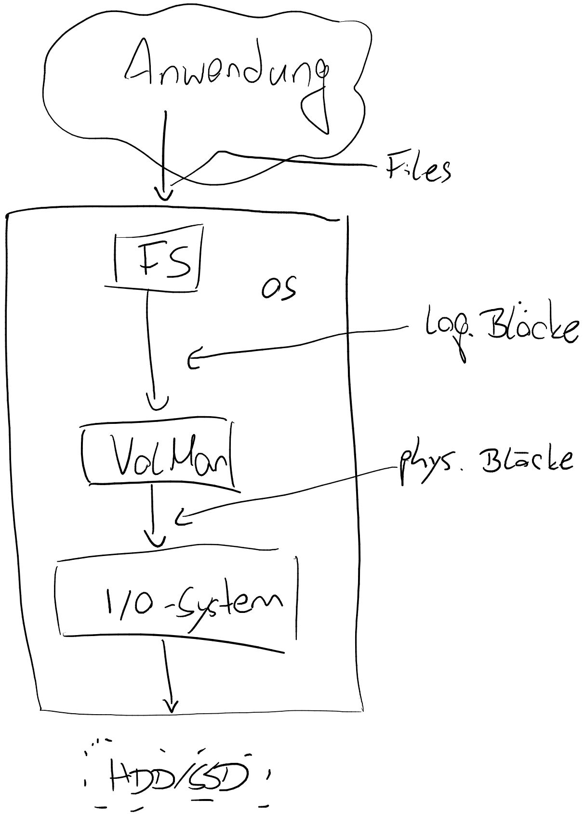

Kryptographie und Softwaresicherheit
====================================

<!-- START doctoc generated TOC please keep comment here to allow auto update -->
<!-- DON'T EDIT THIS SECTION, INSTEAD RE-RUN doctoc TO UPDATE -->
**Inhaltsverzeichnis**

- [Prüfungen](#pr%C3%BCfungen)
- [Einführung und Inhalt](#einf%C3%BChrung-und-inhalt)
- [Symmetrische Verfahren](#symmetrische-verfahren)
- [Asymmetrische Verfahren](#asymmetrische-verfahren)
  - [...SA vs ...DH](#sa-vs-dh)
- [Hybride Verfahren](#hybride-verfahren)
- [Krypto-Analyse](#krypto-analyse)
- [Anforderungen](#anforderungen)
  - [Anforderungen an Zukunft](#anforderungen-an-zukunft)
- [Verschlüsselung langer Daten](#verschl%C3%BCsselung-langer-daten)
  - [ECB (Electronic Code Book Mode)](#ecb-electronic-code-book-mode)
  - [CBC (Cipher Block Chaining Mode)](#cbc-cipher-block-chaining-mode)
  - [CFB (Cipher Feedback Mode)](#cfb-cipher-feedback-mode)
  - [CTR (Counter Mode)](#ctr-counter-mode)
  - [OFB (Output Feedback Mode)](#ofb-output-feedback-mode)
  - [GCM (Galois/Counter Mode)](#gcm-galoiscounter-mode)
- [Hashes & Signatur](#hashes--signatur)
  - [Kollisionen](#kollisionen)
  - [Hash-Verfahren](#hash-verfahren)
  - [Anwendung](#anwendung)
  - [Signaturen](#signaturen)
    - [Voraussetzungen](#voraussetzungen)
  - [Public-Key-Infrastruktur](#public-key-infrastruktur)
  - [Informationen in einem Zertifikat](#informationen-in-einem-zertifikat)
  - [Überprüfung eines Zertifikates](#%C3%BCberpr%C3%BCfung-eines-zertifikates)
  - [Aufgaben einer CA](#aufgaben-einer-ca)
  - [Sperrungen von Zertifikaten](#sperrungen-von-zertifikaten)
  - [Probleme beim CA-System](#probleme-beim-ca-system)
  - [Web of Trust](#web-of-trust)
- [Anwendung: PGP, De-Mail](#anwendung-pgp-de-mail)
  - [Email-Verschlüsselung](#email-verschl%C3%BCsselung)
  - [Email-Authentizität](#email-authentizit%C3%A4t)
  - [PGP](#pgp)
    - [Probleme von PGP](#probleme-von-pgp)
  - [De-Mail](#de-mail)
    - [Sicherheit von De-Mail](#sicherheit-von-de-mail)
- [Anwendung: Bitcoin (Blockchain)](#anwendung-bitcoin-blockchain)
  - [Konsensproblem](#konsensproblem)
- [Kryptographische Zufallszahlen](#kryptographische-zufallszahlen)
  - [normale Zufallszahlen](#normale-zufallszahlen)
  - [physikalischer Zufall](#physikalischer-zufall)
  - [Berechnung von Zufallszahlen](#berechnung-von-zufallszahlen)
  - [Zufallszahlen-Fails](#zufallszahlen-fails)
- [Passwort-Speicherung](#passwort-speicherung)
  - [Passwort online knacken](#passwort-online-knacken)
  - [Passwort offline knacken](#passwort-offline-knacken)
  - [Passwort setzen](#passwort-setzen)
- [Programmierung](#programmierung)
- [Mehr-Faktor-Authentifizierung](#mehr-faktor-authentifizierung)
- [Authentifizierung über das Netz](#authentifizierung-%C3%BCber-das-netz)
  - [Zero-Knowledge-Protokoll](#zero-knowledge-protokoll)
- [Steganographie](#steganographie)
- [Disk Encryption](#disk-encryption)
  - [Unterschied zu File Encryption](#unterschied-zu-file-encryption)
  - [Angriffe auf Disk Encryption](#angriffe-auf-disk-encryption)
  - [Datenträger](#datentr%C3%A4ger)
  - [Passwort-Eingabe](#passwort-eingabe)
  - [Hardware-Verschlüsselung - Self-Encrypting Drive](#hardware-verschl%C3%BCsselung---self-encrypting-drive)
- [TPM](#tpm)
  - [Angriffe](#angriffe)
  - [Der EK](#der-ek)
  - [Der SRK](#der-srk)
  - [Die PCRs](#die-pcrs)
  - [Die AIKs](#die-aiks)
- [Sichere Programmierung](#sichere-programmierung)
  - [Angriffe/Motive](#angriffemotive)
  - [Allgemeines](#allgemeines)
  - [Triviale ID-Vergabe](#triviale-id-vergabe)
  - [Exzessive Rechte](#exzessive-rechte)
  - [File-Tricks](#file-tricks)
  - [Krypto-Sünden (Ergänzung)](#krypto-s%C3%BCnden-erg%C3%A4nzung)
  - [Gegenmaßnahmen allgemein](#gegenma%C3%9Fnahmen-allgemein)
  - [Fehlende Input-Filterung](#fehlende-input-filterung)
    - [SQL-Injection](#sql-injection)
    - [XPath-Injection](#xpath-injection)
    - [LDAP-Injection](#ldap-injection)
    - [Command-Injection](#command-injection)
    - [Cross Site Scripting (XSS)](#cross-site-scripting-xss)
    - [Directory Traversal](#directory-traversal)
    - [Regular Expressions](#regular-expressions)
    - [XML](#xml)
    - [Allgemeine Behebung](#allgemeine-behebung)
- [Speicherüberschreiber](#speicher%C3%BCberschreiber)
  - [Gegenmaßnahmen Speicherüberschreiber](#gegenma%C3%9Fnahmen-speicher%C3%BCberschreiber)

<!-- END doctoc generated TOC please keep comment here to allow auto update -->

<!--newpage-->

# Prüfungen

- Klausur wäre bevorzugt
- Alternativ: Referate über freies Thema, was zu SWS passt
- MPP1: Krypto wird sehr gern geprüft

# Einführung und Inhalt

- Kryptographie = Lehre der Verschlüsselung
- dieses Modul umfasst weiterhin:
  - Verschlüsselungsverfahren
  - (kryptografische) Hashes
  - Signaturen + Zertifikate
  - Anwendung: PGP, De-Mail
  - Anwendung: Blockchain z.B. Bitcoin
  - Kryptographische Zufallszahlen
  - Passwörter
  - Steganographie
  - Anwendung: Disk Encryption
  - Anwendung: TPM
  - Typische Sicherheitslücken, sichere Programmierung
- Vorlesungsziel: Verständnis und Sensibilisierung
  - nicht Ziel: Exakte Detail-Kenntnisse von Algorithmen, Praktische Programmierung, Mathematik, Netzwerkverschlüsselung, IT-Sicherheit - sprengen den Rahmen
- Ziele / Anwendung krypt. Verfahren
  - Geheimhaltung, Vertraulichkeit, Zugriffsschutz: Verschlüsselungsverfahren
  - Integrität: Datensicherheit, krypt. Hash-Funktionen
  - Authentizität: Nichtabstreitbarkeit, Sicherstellung des Senders: Signaturen und Zertifikate
  - Authentifizierung und Passwörter
- Krypto-Algorithmen nie selbst programmieren
- lieber für gut befundene Implementierungen nutzen, bevorzugt Open-Source

# Symmetrische Verfahren

- **selber Schlüssel zum Ver- und Ent-schlüsseln**
- manchmal auch denselben Algorithmus
- arbeiten blockweise, typischerweise zwischen 64 Bit und 512 Bit
- typische Schlüssellänge: 128-256 Bit (Hinweis: 64 Bit sind zu wenig!)
- basieren auf einfachen Bit-Operationen: XOR, Shifts, Rotation, Plus/Minus, Permutationen
  - nur Shift + XOR reicht nicht
  - meist keine Multiplikationen usw., da zu langsam
- relativ einfache Algorithmen, oft in mehreren "Runden" wiederholt
- in HW implementierbar: "Krypto-Beschleuniger"
- Vektor-Einheiten, d.h. SSE/AVX kann verwendet werden
- müssen schnell sein (100MB/s)
- Beispiele:
  - DES (56 Bits, unsicher)
  - Triple-DES
  - IDEA (unfrei)
  - AES / Rijndael (schlechteste Sicherheit, beste Performance v.a. in HW)
  - (Blowfish), Twofish, Serpent (sind weitere, sichere Verfahren)
  - CAST, MARS, CR6
- Problem: Sender und Empfänger braucht denselben Schlüssel
  - Schlüsseltausch - wie wird der Schlüssel sicher übertragen (z.B. über Internet), ohne dass Dritter abfangen kann

# Asymmetrische Verfahren

- Verwendung eines Schlüssel-Paars
  - "öffentlicher" Schlüssel zum Verschlüsseln
  - "privater" Schlüssel zum Entschlüsseln
- Daher auch: Public-Key-Verfahren
- Private Key und Public Key können auch Rollen tauschen, z.B. beim Signieren
- Empfänger berechnet einmalig persönliches Schlüsselpaar, veröffentlicht öff. Schlüssel und verwahrt priv. Schlüssel sicher
- arbeiten ebenfalls blockweise, aber mit größeren Block- und Schlüssel-Längen: 2048 bis 4096, darunter evtl. zu wenig
- Arbeiten intern mit 2048-Bit-Ints, also etwa 600 Dezimalstellen, Multiplikation, Restrechnung,...
- aufwändiger, langsamer
- schlecht durch Hardware- oder Vektor-Befehle zu beschleunigen
- unterschiedliche Algorithmen zum Ver- + Entschlüsseln
- basieren auf Problemen der diskreten Mathematik
  - in einer Richtung schnell (Schlüsselgenerierung)
  - in anderer Richtung extrem aufwändig (berechnen d. priv. Schlüssels mit öff.)
  - **"Einweg-Funktionen"**
- Bsp. 1: Faktorisierung großer Zahlen
  - für zwei große Primzahlen $p$ und $q$
  - $n = p * q$ leicht zu berechnen
  - Berechnung von $p$ und $q$ aus $n$ praktisch unmöglich
- Bsp. 2: Diskreter Logarithmus
  - $a^x \text{kongruent} m \text{mod} p$
  - für $a,x,m,p$ ganzzahlig
  - leicht für $m$ gesucht, $a,x,p$ gegeben
  - sehr schwer für $a,m,p$ gegeben und kleinstes lösendes $x$ gesucht
  - Anwendung: **Diffie-Hellman, DSH, Elgamal**
- ähnliche Idee: ECC = **elliptische Kurven**
- im Wesentlichen auch diskreter Logarithmus, aber nicht mit ganzen Zahlen, sondern Punkten auf Kurven
  - Rechenschritte schwieriger, schlechter auf HW optimierbar, aber kürzere Schlüssel ausreichend
  - Bsp.: ECDSA für Signaturen, ECDH für Schlüsseltausch; Curve25519 gilt als bestes Verfahren

## ...SA vs ...DH

- DH verwendet zusätzlich Zufallszahlen
  - bietet "Forward secrecy"; RSA nicht
- Kenntnis d. priv. asym. Keys sorgt für:
  - aufgezeichnete verschlüsselte Daten nicht entschlüsselbar
  - symm. Keys nicht nachträglich knackbar
  - alte Sessions nicht nachträglich knackbar
- Kennntnis d. sym. Keys einer Session heißt nicht, dass andere Sessions geknackt werden können
- DH heißt, es wird innerhalb einer asym. Verschlüsselung eine sym. Verschlüsselung verwendet, für die mit jeder neuen Session ein neuer Schlüssel generiert wird

# Hybride Verfahren

- Praxis: Kombination beider Verfahren, z.B. SSL/TLS, IPsec, PGP,...
- zuerst asym. Verfahren zum Schlüsseltausch, dann symmetrisch verschlüsselt
- asym. Verfahren sorgt also für die sichere Übertragung des symmetrischen Schlüssels, da symmetrische Verschlüsselungsverfahren wesentlich schneller sind

# Krypto-Analyse

- Ziel: Angriff auf Kryptographie $\rightarrow$ Klartext herausfinden, Schlüssel herausfinden

> **Ein Verschlüsselungsverfahren ist gebrochen, wenn das mit deutlich weniger Aufwand als *Brute Force* gelingt**

# Anforderungen

- kein statistischer / struktureller Zusammenhang zw. Klartext und Chiffrat: **"pseudo-zufälliger Output"**
- keine erkennbare Zusammenhänge *bestimmte Bits im Input / Schlüssel* $\leftrightarrow$ *Bestimmte Bits im Output*
- keine Beschreibung durch ein algebraisches Gleichungssystem
  - verhindert u.a. statistische Analysen (z.B. Zeichenhäufigkeit)
- Beständigkeit gegen **"Known Plaintext"-Attacken**:
  - Klartext und Chiffrat bekannt (zumindest in Teilen)
  - Schlüssel gesucht
  - Extremfall: Krypto-Box in Händen des Angreifers
- Sonderfall **Differenzielle Analyse**
  - kleine Änderung im Original - Rückschluss auf Schlüsselteile aus resultierenden Änderungen im Chiffrat?
  - Anforderung **Lawinen-Effekt = Diffusion**: kleine Änderungen im Klartext bewirken große Änderungen im Chiffrat; sollte immer 50% sein
- Beständigkeit gegen **Seitenkanal-Attacken**
  - Timing- und Stromverbrauchs-Analyse
  - Rückschlüsse aus Sprung- und Cache-Verhalten
  - Analyse der Funk-Abstrahlung
  - **Der Algorithmus muss für Beobachter von außen für alle Inputs + Schlüssel *gleich* rechnen**

## Anforderungen an Zukunft

- "Quantencomputer-feste" Algorithmen
  - bei AES wird effektive Schlüssellänge halbiert
  - faktorisieren / logarithmieren in polynomialer Zeit

# Verschlüsselung langer Daten

- Problemstellung: wie bisherige Verfahren für lange Datenströme nutzen? (Blockchiffre zu Stromchiffre)

## ECB (Electronic Code Book Mode)

- Datenstrom in Blöcke teilen $\rightarrow$ jeden Block separat verschlüsseln
- Nachteile:
  - Gleicher Block = gleiches Chiffrat (Rückschlüsse möglich)
  - Block-Reihenfolge evtl. unbemerkt verfälschbar
- Vorteil: Wiederaufsetzen nach Fehlern / Verlusten (wenn nur ein Block kaputt)

<!--width=600px-->

## CBC (Cipher Block Chaining Mode)

- bei jedem Block wird vor der Verschlüsselung `XOR` mit vorherigem Chiffrat durchgeführt
- Beim ersten Block XOR mit Initialisierungsvektor, z.B. Zufalllszahl
- Problem mit gleichen Blöcken behoben
- Vertauschung d. Reihenfolge fällt auf
- bei Fehler gehen 2 Blöcke verloren

<!--width=600px-->

## CFB (Cipher Feedback Mode)

- Verkettung ähnlich CBC
- XOR mit Plaintext nach Verschlüsselung des vorherigen Chiffrats
- selten verwendet

## CTR (Counter Mode)

- arbeitet pro Block, ohne Verkettung
- Verschlüsselung: Zufallszahl + fortlfd. Zähler
  - erzeugt jedes mal einen anderen pseudo-zufälligen Bitstrom
- Klartext wird danach damit verschlüsselt: XOR mit diesem Bitstrom
- Verschlüsselung + Entschlüsselung ident
- parallelisierbar
- vorausrechenbar (Verschlüsselungs-Berechnung hängt nicht vom Klartext ab)
- Echte Stromchiffre - kann Byte für Byte abeiten
- Bei Bitfehlern nur genau entsprechende Bits betroffen
  - d.h. verfälschbar

<!--width=601px-->

## OFB (Output Feedback Mode)

- s.o., aber statt Zähler wird Output verwendet

## GCM (Galois/Counter Mode)

- wie CTR, aber mit zusätzlicher Auth-Tag-Berechnung
- gilt als derzeit bestes Verfahren
- in vielen Standards verwendet
- Auth-Tag = Prüfsumme $\rightarrow$ fälschungssicher
- "GMAC": Nur Auth-Tag-Berechnung, unverschlüsselt

<!--width=600px-->

# Hashes & Signatur

- bei Dateien, Mails: nur Unverfälschtheit
- Hash + Signatur + Zertifikats-Infrastruktur: Unverfälschtheit, Authentizität, Vertrauenswürdigkeit, Nicht-Abstreitbarkeit
- Hash = Prüfsumme, Fingerabdruck
- oft fixe Länge und kürzer als Nachricht
  - daher bijektive Funktion
- Informationsverlust: Original-Nachricht nicht aus Hash herstellbar
- verschiedene Original-Nachrichten können gleichen Hash haben
- Anforderungen an kryptograph. Hashfkt.:
  - kollisionsresistent
  - Lawineneffekt: kleine Änderung in Original, große Änderung im Hash
  - Einweg-Funktion: darf nie *rückrechenbar* sein
- Hash gilt als gebrochen, wenn schneller als Brute-Force lösbar

## Kollisionen

**Fall 1**

- gegeben, fix:
  - nur Hashwert
  - oder Nachricht A und deren Hashwert
- gesucht: andere Nachricht B, die denselben Hash ergibt
- B wird so konstruiert, dass
  - zu großen Teilen ident zu A
  - einer kleinen, gezielten Veränderung zu A
  - beliebig dazukonstruierte, möglichst unauffällige Veränderung zur "Korrektur" des Hashes

**Fall 2**

- gegeben: gewünschte Nachrichten-Schnipsel (z.B. Anfang)
- gesucht: 2 verschiedene Nachrichten, die den Schnipsel enthalten und denselben, aber nicht vorgegebenen Hash enthalten
- Verschicke B, aber behaupte, A wäre echte Nachricht
- meist leichter als Fall 1

## Hash-Verfahren

- MD4 / MD5: "Message Digest"; seit >10y geknackt
- SHA, SHA1: "Secure Hash Algorithm"; seit 2005 theoretisch geknackt
- SHA-2 = SHA-256, SHA-384, SHA-512: längere SHA-Varianten, noch sicher
- SHA-3

## Anwendung

- Unverfälschtheit garantieren
- Speicherung Passwörter
- lange, hochwertige Zufallszahlen
- OTP (One Time Passwords)
- Challenge-Response-Verfahren
- Blockchain
- wenn Hash-Funktion geknackt, werden Krypto-Zertifikate wertlos

## Signaturen

- Sender / Ersteller berechnet Hashwert, verschlüsselt Hash mit Private Key, verschickt Originaldaten plus Signatur (**enthält** verschlüsselten Hash)
- Empfänger entschlüsselt Signatur mit Public Key, berechnet Hash der Originaldaten + vergleicht
- jeder kann also Signatur prüfen

### Voraussetzungen

Das System ist nur vertrauenswürdig, solange:

- kein unbefugter Zugang zum Private Key
- Zusammenhang zwischen Schlüsselpaar und Identität der Person

Lösungsansätze:

zu 1.:

- **Qualifizierte elektronische Signatur**: privater Key auf Chipkarte gespeichert, verlässt Karte nie
- aktive Karte, kann rechnen, Signatur auf Karte berechnet
- Certificate Authority (CA) darf keine Kopie des Private Key haben

zu 2.: Nutzung von Zertifikaten: PKI / Public Key Infrastructure

- Sicherstellung der Vertrauenswürdigkeit von Public Keys
- Sicherstellung ihrer Zuordnung zu Person / Firma / Webserver / ...
- sichere Identifizierung

## Public-Key-Infrastruktur

- PKIs basieren auf Zertifikaten
- CA-Hierarchie
- Zertifikat ist Public Key + Zusatzdaten (z.B. Eigentümer)
- Zertifikat signiert mit **Key der CA**
  - d.h. überprüfbar, manipulationssicher,...

## Informationen in einem Zertifikat

- z.B. im genormten X.509-Format
- Public Key
- Eigentümer (Person, Firma, Domain,...)
- Zulässigkeit, z.B. für Domains bei HTTPS
- Austeller (=CA)
- Gültigkeitsbereich (Zeitraum)
- Versions- und Algorithmus-Informationen

## Überprüfung eines Zertifikates

- Signatur korrekt? / Daten unverfälscht?
- zeitlich noch gültig?
- oft: richtiges Zertifikat? / richtige Domain?
- wurde Zertifikat widerrufen? (Anfrage mittels OCSP oder CRL)
  - entspricht Blacklist
- Zertifikat vertrauenswürdig? / Zertifikatskette bis zur Root-CA OK?
  - entspricht Whitelist
- **Problem: wie prüft man den Key der CA?**
  - hierarchisches System $\rightarrow$ übergeordnete CA signiert untergeordnete
  - **Root-CA** (es existieren ein paar hundert) werden von Betriebssystem / Browser gespeichert und gelten **ohne weitere Prüfung** als vertrauenswürdig
  - Bsp. Root-CAs: DigiCert, D-Trust,... (kosten viel Geld); LetsEncrypt, CaCert als Community-CAs

## Aufgaben einer CA

- prüfen Korrektheit, Identität und Berechtigungen des Antragstellers
- erzeugt Schlüsselpaar
- stellt Zertifikat für Public Key aus, übermittelt Private Key geheim an Antragsteller *(und löscht ihn dann hoffentlich)*
- führt Liste ihrer ausgestellten Zertifikate
- verwaltet Sperrliste

## Sperrungen von Zertifikaten

- wenn...
  - Private Key gestohlen
  - Daten des Beantragers stimmen nicht mehr
  - Kriminelle Aktivitäten des Beantragers
- Ungültigkeitserklärung vor Ablauf der Gültigkeit
- CRL = Certificate Revocation List oder Online-Zertifikats-Prüfdienst (OCSP)
- Browser / OS speichert CRL lokal
- auch: Sperre einer CA ($\rightarrow$ Sperre aller ausgestellten Zertifikate)
  - CA stellt Zertifikate an Unberechtigte aus
    - insb. Sub-CA-Zertifikate
  - privater Schlüssel wird kompromittiert
  - Angreifer bricht in CA ein
  - CA arbeitet unsicher, z.B. *verliert* Private Keys

## Probleme beim CA-System

- Kette kann irgendwo unterbrochen werden
  - alle darunterliegenden Elemente plötzlich ungültig
- Behebung für SSL-Zertifikate, ID-Karten,...: neue Zertifikate, hoher Aufwand
- Behebung bei signierten Dokumenten: **Keine!**
- Angriffspunkt lokale Root-CA-Liste: Manipulation
  - lokaler Rechner vertraut dann Angreifer
  - *böse* SSL-Server werden vertrauenswürdig
  - MITM-Angriffe möglich
- Erweiterung der Root-CA-Liste üblich für Corporate Virenscanner, SW-Auto-Update,...
  - **Just don't!**
- Beantragung von Zertifikaten kostet **Zeit, Aufwand, teilweise Geld**
  - Konsequenz: es werden Self-Signed Zertifikate verwendet $\rightarrow$ nicht gut

## Web of Trust

- nicht-hierarchische Alternative zu CAs (z.B. für PGP)
- zwei Beziehungen zwischen Teilnehmern
  - X **kennt** Y (persönlich)
    - X signiert Schlüssel von Y
  - X **vertraut** Y, dass Y nur Schlüssel von Personen signiert, die er tatsächlich kennt
- d.h.
  - X vertraut von Y signierten Schlüsseln
  - Y hat Schlüssel von Z als "bekannt" signiert
  - X betrachtet daher Schlüssel von Z als gültig
- kann weniger streng sein: auch indirekt über mehrere vertrauende Personen hinweg
- kann strenger sein: mehrere vertrauenswürdige Y müssen Z signiert haben
- Dazu notwendig: **Schlüsselserver**
  - enthalten Public Keys der Teilnehmer, gegenseitig ausgestellte Signaturen
- Datenschutz-relevant: Namen, Mail-Adressen, "kennt" und "vertraut"-Informationen sind sensible Informationen

# Anwendung: PGP, De-Mail

## Email-Verschlüsselung

- Standardmäßig keine End-to-End-Verschlüsselung
- Mails liegen in Klartext auf Hops
- Verschlüsselung **bestenfalls** Host-to-Host
  - Zwischen zwei Servern
  - Zwischen Server und Client
- Prinzip: kleinster gemeinsamer Nenner: verschlüsselungs-unwilliger Server heißt, dass Klartext genutzt wird

## Email-Authentizität

- Header sind "Schall und Rauch": weder Verschlüsselung noch Prüfsumme möglich
- Header können schon beim Absender, aber auch von jedem Zwischenserver gefälscht werden

## PGP

- Lösungsansatz für die beiden obigen Kapitel
- "Pretty Good Privacy"
- durch RFC4880 standardisiert $\rightarrow$ freie Implementierungen: OpenPGP und GPG
- Kombination aus sym. + asym. Verschlüsselung
- falls gewünscht, wird Signatur zur Nachricht (verschlüsselt mit dem Private Key des Senders) beigefügt
- mit zufällig erzeugtem Schlüssel wird Nachricht symmetrisch verschlüsselt
- sym. Schlüssel wird asym. mit Elgamal verschlüsselt
- aufgrund technischer Beschränkungen wird Base64 kodiert

### Probleme von PGP

- Sicherheit des Schlüsselrings
- Authentizität: Wer garantiert die Zuordnung zwischen Schlüsseln und Personen?

## De-Mail

- technisch normales Mail-Format mit TLS, IMAP/POP, SMTP
- Zwei-Faktor-Authentifizierung, aber qualifizierte Signatur keine Pflicht
- Sende-/Empfangs-Nachweise vom Dienstanbieter signiert
- organisatorisch nur von zertifizierten Anbietern; durch Ausweisprüfung identifizierte Benutzerkonten

### Sicherheit von De-Mail

- verpflichtend: Host-to-Host-**Inhalts**-Verschlüsselung
  - ergibt keinen Sinn, da Inhalt auf Servern entschlüsselt
- End-to-End ist optional, muss vom Sender / Empfänger mit z.B. PGP erfolgen, aber **zentraler Keyserver**
- Hashwert für Integrität optional: Signatur am ersten / letzten Server, nicht am Client
- Viele Datenschutz-Aspekte offen:
  - Vorratsdatenspeicherung?
  - großzügiger Zugriff auf Personendaten, Mails und De-Mail-**Passwort** durch BKA <!--hmm wie werden die Passwörter dann wohl gespeichert?-->
- daher nicht vertraulich / geheim und daher zu vermeiden

# Anwendung: Bitcoin (Blockchain)

- Blockchain-basierte Speicherung von Transaktionen zwischen Wallets
- P2P-Netzwerk, in dem Daten über Transaktionen und Blöcke in der Blockchain ausgetauscht werden
- Bitcoin-Regelwerk: Protokoll und dessen Implementierung
- Erzeugung und Unverfälschbarkeit: Hashing mit SHA-256
- Absicherung der Wallets
- Signatur mit 256 Bit ECDSA
- jeder Block enthält kryptografischen Hash des **vorherigen** Blocks, Zeitstempel, *beliebige Nutzdaten*
- jede nachträgliche Veränderung ist erkennbar
- Verwendung für Alles, was fälschungssicher protokolliert werden muss (Prüfprotokolle, Lieferketten, Transaktionen, ...)
- alle Blöcke vorher müssen erhalten bleiben $\rightarrow$ Bitcoin-Blockchain derzeit 340GB (stetig wachsend)
- jeder Block enthält variable Zusatzbits (Nonce), die durch "Mining" bestimmt werden
- dezentral gespeichert $\rightarrow$ viele gleichberechtigte Kopien auf der Welt verteilt
- asynchrone Kommunikation (d.h. langsam, verzögert, unzuverlässig)
- Proof of Work (Mining) reguliert durch:
  - Höhe der Block-Belohnungen
  - Anpassung der benötigten führenden Nullen im Hash
- Transaktionen werden mit Private Key des Wallets signiert $\rightarrow$ nur der Besitzer des Wallets kann ausgehende Transaktionen erzeugen

## Konsensproblem

- Wer darf anhängen? Welcher neue Block wird unter Konkurrierenden akzeptiert?
- Kollisionsbehandlung mit Proof of Work und Regelwerk
  - Warten, bis ein weiterer Block angehängt wird
  - längste Kette gewinnt
  - Blöcke der Verlierer wandern zurück in den Pool der unbestätigten Transaktionen
- Manipulationssicherheit des System bricht zusammen, wenn ein Teilnehmer >50% der Rechenleistung kontrolliert

# Kryptographische Zufallszahlen

- Verwendung: Schlüsselgenerierung, Initialisierungsvektor für Stromverschlüsselungen
- Challenge-Response-Abfragen
- Passwort-Salt
- wichtigste Eigenschaft: die vorherige / nächste Zufallszahl darf nicht vorhersagbar sein

## normale Zufallszahlen

- auch Pseudo-Zufallszahlen genannt
- sind berechnet und damit vorhersagbar
- zyklisch $\rightarrow$ ein "Kreis" von Zahlen; je länger der Zyklus desto besser
- nicht für Kryptographie geeignet
- Generator wird mit "Seed" gestartet
  - Bsp. für Seeds: externe Quellen wie Tastatur-/Mauseingaben und interne Quellen wie Netzwerklast, Zeit zwischen empfangenen WLAN-Paketen, freilaufender Zähler mit Prozessortakt

## physikalischer Zufall

- meist Zeitabstände zwischen Interrupts
- nur in endlicher Menge + Datenrate verfügbar, besonders kurz nach dem Bootvorgang
- bei Servern und Embedded Devices besonders kritisch, da oft die Quellen fehlen
- schneller besser: Hardware-Zufallsgenerator mittels thermischen (weißem) Rauschen von Halbleitern, Analogsignalen, radioaktiver Zerfall, Hintergrundrauschen

## Berechnung von Zufallszahlen

- im einfachsten Fall physische Inputs auf Qualität prüfen und zusammenhängen $\rightarrow$ Kryptographische Hashfunktion
- Linux: Nutzung eines Pseudozufallgenerators mit langer Periode; wird regelmäßig mit physikalischer Zufallszahl
- Alternative: BBS-Generator (Blum-Blum-Shub-Generator), der auf Faktorisierungsproblem basiert

## Zufallszahlen-Fails

- Ergebnismenge ist kleiner als erwartet $\rightarrow$ Brute-Force geht schneller
- Berechnen des internen Status einfacher als erwartet
- NSA standardisierte geschwächten Generator ``Dual_EC_DRBG``: für bestimmte Parameter plötzlich schlecht verteilte Zufallszahlen
- versehentlicher Implementierungsfehler in OpenSSL in Debian, damit nur $2^{15}$ Zufallszahlen
- MIFARE-Hack (u.a. schlechter Random Seed)

# Passwort-Speicherung

- Klartext-Passwort sollte **nie** gebrauchen
- Nutzung von Einweg-Verschlüsselung: Hashing $\rightarrow$ sichere Speicherung
- evtl. wird mehrere tausend Mal gehasht, z.B. mit Argon2, scrypt, bcrypt und sollten **langsam** sein
- Beim Hashen nicht vergessen: Salts ("Salzen")
  - wird bei jedem Ändern des Passworts neu erzeugt
  - mit Hash kombiniert und Klartext gespeichert
  - für n Möglichkeiten des Salts ver-n-fachen sich die Rainbow-Tables

## Passwort online knacken

- Brute-Force-Bremsen einbauen, z.B. mit Wartezeiten, Account-Sperren, Fehlermeldungen dürfen keine Informationen leaken $\rightarrow$ quadriert Anzahl der Versuche bei unbekanntem User

## Passwort offline knacken

- gestohlene Passwort-Datei liegt vor
- zu testende Passwort-Kandidaten werden gehasht und es wird geprüft, ob dieser Hash in der Datei vorkommt $\rightarrow$ dauert zu lange
- Wörterbuchattaken: häufig genutzte Passwörter, Worte, 13375p34k, umgedreht,...
  - kann vorberechnet werden, um Angriff zu beschleunigen
  - kann aber TB-groß bis PB-groß werden $\rightarrow$ Datenstruktur "Rainbow Table" entwickelt, um das zu lösen; praktikabel für einfache Hash-Algorithmen ohne Salz und max. 10 Zeichen

## Passwort setzen

- fordern: mind. 12 Zeichen, großer Zeichensatz
- Passwörter bereits auf Wörterbuch-Attacken und andere "Blödheiten" prüfen
- regelmäßige Passwortänderungen sind kontraproduktiv, hilf nur gegen heimlich geklaute Klartext-Passwörter
  - Nutzer verwenden einfachere Passwörter, notieren sich eher, ändern Teile systematisch
- Gefahr: selbes Passwort wird für viele Dienste verwendet $\rightarrow$ kein technisches Problem; Dienstanweisung etc. helfen evtl.
- Für Hochsicherheit: Passwörter nur aus Generator erlauben, müssen gut merkbar sein (aus Silben bestehend, lange Phrasen), Auswahl aus mehreren Vorschlägen, nach außen hin unbekannte Generator-Logik

# Programmierung

- alle Passwort-Änderungen, alle Anmeldungen im Systemlog; evtl im Frontend: Zeitpunkt letzter Anmeldung
- Passwort-Änderungen: immer doppelt fordern, gegen Tippfehler
- kein Betrieb ohne oder mit Default-Passwort ermöglichen; vorgegebene Passwörter müssen sofort geändert werden und müssen für jeden Nutzer anders sein
- in C-Strings: jedes Passwort nach Nutzung mit gleich langem String ersetzen; in nicht-auslagerbaren Speicher speichern; kein Debugging; keine Coredumps erlauben
- kein 100%iger Schutz möglich (besonders in VMs)

# Mehr-Faktor-Authentifizierung

- etwas, das man hat: Handy, Chipkarte, Token, Biometrie,...
- etwas, das man weiß: Passwort
- etwas, das sich immer ändert: Zeit, zufällige Challenge, die jedes Mal für dieselben Nutzdaten ein anderes Ergebnis liefert

# Authentifizierung über das Netz

- Niemals Klartext-Passwort über das Internet, auch nicht mit TLS; auch nicht mit demselben Hash
  - Grund: Replay-Attacken
- Hash am Client erzeugen; Message darf nicht zwei mal gültig sein
- Negativ-Beispiele: FTP, Telnet, Remote-Desktop (Tastatureingaben werden übermittelt), POP, IMAP, SMTP

Lösungsansätze:

- listenbasierte One-Time-Passwords (OTPs), z.B. TAN-Listen
- Hashbasierte OTPs: `i`-ter Passcode = `n-i` mal gehashter Geheimcode
  - letzter Hash berechenbar, Nächster nicht
- Security Token
- CR-Verfahren

## Zero-Knowledge-Protokoll

- "beweise, dass du einen Schlüssel besitzt, ohne ihn preiszugeben"
- A hat Geheimnis, B will das prüfen, darf das Geheimnis aber nicht berechnen können; A darf aber nicht vortäuschen, den Schlüssel zu kennen
- Ablauf:
  - Großes n als Primzahlprodukt berechnen und n veröffentlichen
  - Prüfung in mehreren Runden: A und B tauschen pro Runde 3 Zahlen aus, die aus Zufallszahl berechnet werden
  - B prüft empfangenen Zahle gegen die Öffentlichen
- mit jeder Runde verdoppelt sich die Sicherheit, dass n und v zu s gehören, ohne dass B oder ein Dritter dieses berechnen könnten

# Steganographie

- heißt "verdecktes Schreiben"
- keine Verschlüsselung, sondern Tarnung, zum Transport oder Speicherung, ohne dass es auffällt
- klassisches Verfahren: um einen inneren Text wird ein sinnvoller äußerer Text geschrieben
- heute modern: Code in Bild, Video, Ton, z.B. niederwertigste Bits ändern, sodass es nicht auffällt
- die "offensichtlichen" Daten sind unverschlüsselt, harmlos, unverdächtig; steht nicht in Zusammenhang mit verstecktem Inhalt
- es wird trotzdem verschlüsselt, da erhöhte Sicherheit und gleichverteilte Bits (weniger auffällig)
- um ein Payload wird in Praxis eine Verpackung konstruiert
- Sonderfall MIC: bei Druckern wird heimlich *verirrte* Pixel in bspw. gelb an bekannten Stellen platziert, um Ausdruck rückverfolgbar zu machen (Seriennummer, Datum, Uhrzeit)
- Sonderfall Wasserzeichen: kodiert unauffällig Copyright; möglichst wenig Daten aber hohe Robustheit gegen Umcodierung, Kompression, Aussschnitte, ...

# Disk Encryption

- keine Anwendung, sondern im OS oder als Treiber; zwischen Filesystem und I/O-Treiber
- ver-/entschlüsselt jeden phys. Block vor/nach Zugriff
- Verschlüsselung sieht nur Disk-Blöcke ohne Kenntnis ihrer Bedeutung, daher FS-unabhängig
- arbeitet transparent und "on the fly"
- sobald entsperrt, sind alle Daten lesbar
- Zweck: z.B. Diebstahlschutz, Schutz vor fremden Betriebssystemen
- schützt nicht vor Fremdzugriff in einer angemeldeten Sitzung, Malware, Fileshares

<!--width=400px-->

## Unterschied zu File Encryption

- File-Encryption verschlüsselt nur den Inhalt, nicht die Metadaten
- meistens normale Anwendung im Userspace
- wird **explizit** aufgerufen

## Angriffe auf Disk Encryption

- RAM enthält ständig den Key $\rightarrow$ verwundbar gegen DMA; RAM enthält selbst nach Stromverlust noch einige Sekunden lang lesbare Daten
- Hibernate enthält alle RAM-Daten
- Hardware-Verschlüsselung in Datenträgern bleibt entsperrt, solange Energie erhalten bleibt
- Backups auf Dateiebene sind dann entschlüsselt, insofern das Backup nicht separat verschlüsselt ist

## Datenträger

Es gibt verschiedene Arten der Disk Encryption:

- Physical Volume / komplette Platte
  - inkl. Bootsektor, Partitionstabelle,...
- Logical Volume / Filesystem
  - Partition, RAID-Laufwerk, LVM
  - ohne Boot-Sektoren, Partitionstabelle,...
- Container
  - eigenständiges Filesystem in einer großen Datei
- Hidden Volume
  - Container, aber unsichtbar in unbenutzten Blöcken eines Outer Filesystems (meist auch verschlüsselt)
  - Existenz kann im Notfall abgestritten werden
- Verschlüsselung aller Nutzerdaten auf Linux relativ einfach, da diese auf anderer Partition gespeichert werden können
- symmetrische Verschlüsselung mit 128 oder 256 Bit Key
  - Key entweder als gehashtes Passwort oder zufällig erzeugt und mit Passwort verschlüsselt
  - nur verschlüsselter Key wird gespeichert und Klartext-Key als Recovery Key ausgegeben und dann gelöscht

## Passwort-Eingabe

- bei kompletter Verschlüsselung: Pre-Boot-Kennwort
- nur Hardwarebindung: nur TPM, kein Kennwort
- nur Diebstahlschutz: Erreichbarkeit eines Firmenservers
- bei verschlüsselten Systempartitionen:
  - Windows und Mac booten Minimalsystem nur für Passwortabfrage usw. von unverschlüsselter Partition
  - Linux: Booten von unverschlüsselten Kernel mit Passwortabfrage im initrd-Modus
- ggf. erkennt TPM Veränderungen im unverschlüsselten Teil

## Hardware-Verschlüsselung - Self-Encrypting Drive

- eingebaute Verschlüsselung in Datenträger
- alternativ "MITM-Verschlüsselung" mit Zwischenstecker
- Key nur im Laufwerk bekannt, kann mit "Quick Delete" dauerhaft gelöscht werden
- Disk-Blöcke werden unabh. voneinander verschlüsselt
- innerhalb eines Disk-Blocks wird verkettet: XTS-Mode
- Problem: welcher Initialisierungsvektor?
  - jedesmal zufällig: sicherer, aber aufwändiig
  - fixer IV: unsicher
  - Sektornummer: besser, aber Teilangriffe möglich
  - verschlüsselte Sektor-Nummer: heute beste Lösung
    - eine Hälfte für Nutzdaten, andere Hälfte für Verschlüsselung der Sektornummer

# TPM

- "Trusted Platform Module"
- generiert und speichert Schlüsselpaare
- ver- und entschlüsselt "on Chip" (Schlüssel verlassen also Chip nicht)
- berechnet Zufallszahlen und Hashes; signiert
- CPU übersteigt Geschwindigkeit des TPM und Schnittstelle langsamer
- Sekundäre Funktionen: "Trusted System" und "Tamper Protection"
- berechnet, speichert und verifiziert Prüfsummen von Hard- und Software (offiziell zur Softwaresicherheit)
  - lückenlos abgesicherte Boot-Kette; PC bootet nur in "sicheren" Zustand
- Praxis: DRM-Medienschutz, Aussperren von alternativen Betriebssystemen wie Linux; nimmt Freiheit von Nutzern, z.B. durch Ausschluss von Hardware- oder Sotware-Mods
- weniger der Nutzer, sondern eher Dritte (Rechte-Inhaber) können dem System vertrauen
- *"TPM schützt die Software vor dem Benutzer?!"*
- TPM kann Nutzer weltweit eindeutig identifizieren
  - ermöglicht individuelle Bindung von Lizenzen und DRM-Inhalten sowie Vendor-Lock-In
- erzeugt "zugesperrte" PCs: lückenlose Kontrolle über Smartphones, Apple-Geräten, Konsolen,...
- herstellerunabhängiger Standard von der Trusted Computing Group (TCG); Mitglieder sind Hardware- und Software-Hersteller (Intel, Microsoft, HP, IBM, ...)
- Bestandteile: eigener Prozessor, RAM, ROM, EEPROM
- angebunden via Steckmodul (LPC- oder SPI-Bus) oder integriert im Chipsatz
  - kein Busmaster, kann System also nicht selbstständig ansprechen $\rightarrow$ muss von CPU gestartet werden
- Initialisierung erfordert "Core Root of Trust for Management" (CRTM) / Trusted Root
  - In BIOS oder eigenem Chip realisiert
  - Initialisiert TPM, prüft HW und BIOS auf Integrität, fragt Smartcards oder Passwörter ab
- ermöglicht "Trusted Software Stack" (TSS) bzw. "TCG Software Stack" für OS und Libraries
  - Anwendungszugriff auf TPM
  - kaum vollständige Implementierungen
- großteils skeptisch aufgenommen oder abgelehnt:
  - Angst vor DRM und Software-Monopolisierung
  - Politik der TCG: geheime Arbeit, geheime Dokumente, hohe Mitgliedskosten

## Angriffe

- wenige und modulspezifisch
- Seitenkanal-Attacken
- Vorfall: knackbare RSA-Schlüsselpaare
- Hardware gilt als sicher
- Software ist zweifelhaftes Stückwerk

## Der EK

- "Endorsement Key"
- hart eingebrannt und nicht auslesbar
- codiert Echtheit, Hersteller und Nummer
- Basis für alle weiteren Keys
- bleibt vor Anwendungen verborgen; diese dürfen nur ihren eigenen AIK erfahren
- Nutzeridentifizierung durch Anwendungen indirekt über unabhängige CAs oder Zero-Knowledge-Protokoll
- Problem des EK: TPM-Hersteller kennt privaten Schlüssel; ermöglicht Tracking, Key-Fälschung, Weitergabe an Dritte
  - daher TPM-Feature "neuen EK erzeugen" $\rightarrow$ ist nicht vertrauenswürdig oder zertifiziert, also weitgehend nutzlos

## Der SRK

- "Storage Root Key"
- Wurzel des Schlüsselbaums
- bei Erstbenutzung generiert: EK + (Passwort oder Biodaten)
- einmalig, kann nicht wiederholt werden

## Die PCRs

<!--nein, das ist kein COVID-Test-->

- "Platform Configuration Registers" (mind. 24)
- Hashwerte über Hardware, Firmware, OS, Software und Config-Daten
- kann in AIK-Berechnung einbezogen werden
- quasi Blockchain

## Die AIKs

- "Attestation Identity Key"
- permanent gespeicherte Keys für Lizenzen und DRM-Inhalte
- jeder Anbieter hat eigenen Key zum Datenschutz
- Erstellung bei Lizenz-Erwerb, mittels Challenge-Response-Verfahren aus:
  - Challenge + Key
  - EK
  - signierte Hashes von gewählten PCRs (also Bindung an HW oder SW)
- bei Software-Start: AIK-Prüfung

# Sichere Programmierung

## Angriffe/Motive

- Datendiebstahl z.B. zum Verkauf der Daten
- Datenzerstörung, -verschlüsselung, -veränderung z.B. zur Erpressung
- Denial Of Service, also Ausfall
- Resourcendiebstahl (Rechenzeit, Internet, Speicherplatz)
- Motivation: *"Ich bin so cool"*, wirtschaftliche Gründe (Spionage, Wettbewerbsvorteil, Rufschädigung,...); persönliche Gründe; politische, geheimdienstliche Absichten; Geld
- Situation Angreifer:
  - Erpressung: Datenwiederherstellung, Beendigung des DOS, Nicht-Veröffentlichung von Daten, Erpressung Dritter
  - Verkauf: gestohlene Daten, Zugänge und Backdoors, Exploits
  - Nutzung der Daten: Finanzbetrug, Fake-IDs, Nutzung im wirtschaftlichen Sinne
- Situation Opfer:
  - Betriebsstillstand, Produktionsausfall, Maschinenschaden
  - Kosten für Wiederherstellung, Bereinigung, externe Hilfe
  - Datenverlust: Kundendaten, Buchhaltung, entwickelte Software, Know-how, Pläne
  - Erpressungskosten
  - Umsatzminderungen durch Rufschädigungen, Kundenverlust
  - Strafe nach DSGVO
  - Schadensersatzzahlungen
  - Konkurs?

## Allgemeines

- große Software: haben CVE-Nummern
- meistens Standardfehler, selten "echt falscher" Code
- Sicherheitslücke = fehlender Code (Input-Prüfungen, Returncode-Prüfungen,...)
- oft auch Verwendung unsicherer Konstrukte
- **"Schlamperei und fehlendes Wissen"**
- jeder kann jeden Code untersuchen:
  - Reverse Engineering (Disassemblierung)
  - gezielte Tests mit konstruiertem Input (z.B. mit automatisierter "Fuzzer"-Software)
- nachträgliche Reparatur teurer als "gleich richtig machen" (finanziell, vom Ruf her,...)
  - "Rule of Ten": Die Fehlerkosten eines nicht entdeckten Fehlers erhöhen sich von Stufe zu Stufe der Wertschöpfung/Entwicklung um den Faktor 10

## Triviale ID-Vergabe

- fortlaufende oder vorhersagbare Vergabe von Session-IDs, Cookies, URLs für Dokumente
  - Lösung: verstreute IDs, benachbarte Werte dürfen nicht gültig sein; lange "Totzeit"; Prüfen, ob URL zu Session gehört
  - Lösung: "Einmal-IDs": selber Request mit selber Session wird nur einmal akzeptiert (Schutz gegen Replay-Attacken)
- Client-seitige Prüfungen
  - Client könnte manipuliert sein; MITM-Attacken
  - **Daten vom Client sind nie vertrauenswürdig** \rightarrow\rightarrow alle sicherheitsrelevanten Prüfungen müssen am Server stattfinden

## Exzessive Rechte

- Rechte aller angelegten Dateien, DBs, IPCs,... sind explizit so restriktiv wie möglich anzulegen
- Server-Code aufspalten:
  - Variante 1: alle Operationen beim Start mit erhöhten Rechten ausführen, dann erhöhte Rechte abgeben (eigene Server-UID)
  - Variante 2: getrennte Prozesse; einer mit erhöhten Rechten (so wenig Code wie möglich) und einer mit normalen Rechten (Großteil des Codes)
- temporäre Dateien in einem Unterverzeichnis anlegen, wo Rechte kontrolliert werden

## File-Tricks

- Szenario: Server will temp. File anlegen, Angreifer legt Link der Zieldatei auf `/etc/passwd` \rightarrow\rightarrow Server überschreibt diese Datei
- Ursachen:
  - Anlegen in *öffentlichen* Ordnern wie ``/tmp``
  - Anlegen von Dateien mit fixen / erratbaren Namen
  - Anlegen ohne atomare Existenzprüfung

## Krypto-Sünden (Ergänzung)

- Nutzung von Pseudo-Zufall
- "inoffizielle" Zertifikate, die den Nutzer zum Akzeptieren einer Ausnahme zwingen
- automatische Updates ohne Absicherung der Verbindung und des Inhaltes

## Gegenmaßnahmen allgemein

- Schulungen für Programmierer, Tester, Nutzer
- Programmier-Richtlinien
- Nutzung sicherer Programmier-Standards
- Tools für Sicherheits-QA
- Code Reviews und Bug Bounties
- externe Audits, Penetration-Tests

## Fehlende Input-Filterung

- Was filtert man? z.B. SQL-Injections, JavaScript, HTML, alle Shell-Aufrufe (Klassiker: Mailadressen), ...
- Grundproblem: Eingaben (Web, CLI, Formulare, ...) werden nicht gefiltert; durch Terminalsymbole kann unerwarteter Effekt ausgelöst werden
- Kategorien: SQL-Injection, Command Injection, Cross Site Scripting, Directory Traversal, Format String Exploits (z.B. ``printf``: formatiert Strings, interpretiert `%`)
  - Regular Expressions (nutzen JIT-Compiler; erlauben Rekursion)

### SQL-Injection

- Input wird als String in SQL-Befehl eingebaut
- Problem: String-Ende-Symbol wird nicht gefiltert
- Effekt: alles nach String-Ende-Symbol wird als separates Statement ausgeführt

### XPath-Injection

- ähnlich zu SQL-Injections
- XPath ist Abfragesprache für XML
- Problem: Einbau von Terminalsymbolen in Nutzereingaben

### LDAP-Injection

- ähnlich zu SQL-Injections

### Command-Injection

- Input wird als Parameter in Shell-Befehl verwendet
- Problem 1: Directory Traversal
- Problem 2: Command-Trenzeichen nicht gefiltert; Rest wird als eigener Shell-Befehl ausgeführt
- Problem 3: Pipes nicht gefiltert `<` `>`: Auslesen oder Überschreiben beliebiger Dateien
- Problem 4: die zukünftigen Features einer Shell sind fast unüberschaubar \rightarrow\rightarrow Filterung könnte zukünftig nicht mehr reichen

### Cross Site Scripting (XSS)

- Problem 1: JavaScript läuft auf allen Clients
- Problem 2: HTML lädt Bilder nach, verlinkt dynamische Inhalte, ...
  - Werbung, Klick-Betrug, ...
- Problem 3: Schadware auf Clients

**Cross-Site Request Forgery**:

- mittels XSS eingefügter HTML-Schadcode enthält Requests an Zielserver, der anmeldepflichtige Dienste anbietet
- Wenn Opfer noch angemeldet, werden automatisch (siehe Session Cookie) korrekte Anmeldedaten übermittelt
- Anfragen werden akzeptiert und sind nicht von legitimen Requests zu unterscheiden

### Directory Traversal

- Input wird als Filename oder URL verwendet
- Fall 1: sollten gar keinen Directory-Teil enthalten
  - Problem: `/` und `\` nicht gefiltert
- Fall 2: Pfad sollte nur relativen Pfad unterhalb enthalten
  - Probleme: `../`; `C:\`; `//...` (Windows Server)

### Regular Expressions

- RegEx wird innerhalb eines Textes eingebaut
- kann Denial of Service verursachen
- Filter regelt nicht mehr wie geplant (filtert mehr oder weniger als erwartet)
- `.` passt für jedes Zeichen außer `\n`

### XML

- erlaubt Inkludieren von beliebigen anderen Dateien, auch Remote
- schlimmstenfalls: Anzeigen der Datei

### Allgemeine Behebung

- Dank Unicode ist Sperrliste von Zeichen unzuverlässig
- Whitelist hat ähnliches Problem: alle "harmlosen" Zeichen erfassen ist unpraktisch, nicht zukunftssicher
  - dennoch in vielen Fällen am Besten
- **nach** Hex-Dekodierung filtern
- Nutzung von Zeichenklassen-Prüffunktionen (`isalpha`, `isdigit`, ...)
- evtl. kein Unicode erlauben (abh. vom Backend)

# Speicherüberschreiber

- oft auf OS-Level
- durch einen Programmierfehler gelingt es, unautorisiert Speicherbereiche zu überschreiben
- analog: Buffer Overflow $\rightarrow$ ein Buffer (z.B. Arrays) ist übergelaufen und wurde über sein Ende hinaus beschrieben
- erlaubt *potentiell* beliebige, unautorisierte Code-Ausführung
  - potentiell bedeutet, dass eine genauere Analyse noch aussteht. Fehlt es, sind das schlechte Nachrichten
  - prinzipiell erlaubt jeder Speicherüberschreiber die *potentielle* Code-Ausführung
  - Code in Form von echtem Binärcode oder kleine Code-Fragmente (nicht standalone) $\rightarrow$ kein separater Prozess, sondern innerhalb des laufenden Programms; **Manipulation des Programm-Ablaufs**
  - oft in Text, Bild, Video,... eingebettet
- Manipulation des Programmablaufs erfolgt, indem der Speicherüberschreiber einen bereits vorhandenen Pointer *ersetzt*
- Payload kann meist nur wenig tun, ist oft sehr kurz
  - z.B. Shell-Befehl, lädt Programm aus Netz nach, nutzt andere Sicherheitslücken $\rightarrow$ "Türöffner"
- normaler Programmcode während der Ausführung schreibgeschützt, daher nicht manipulierbar
- im normalen, schreibbaren Datenbereich gibt es Pointer auf Code $\rightarrow$ Angriffsziel
- Angriffsziele:
  - primär: Return-Adressen von Funktionsaufrufen <!--Programm springt bei return an Adresse, um im Aufrufer fortzusetzen-->
  - Funktionspointer
  - Global Offset Table (GOT)
  - Procedure Linkage Table (PLT) (Teil vom dynamischen Linker)
  - ``setjmp`` und ``longjmp``
  - In C++ die Typ-Informationen in Objekten, mit dem eigentlichen Ziel, die ``vtable`` zu manipulieren
- Codepointer sind für Programmierer *nicht direkt* sichtbar, können aber überschrieben werden, bpsw. durch Verletzung der Arraygrenzen
- fast alle Sprachen sind davon betroffen, aber vor allem Sprachen **ohne Prüfung von Pointern und Indizes**, wie C, C++ und Assembler
- Ursachen:
  - ungeprüfte Input-Längen, v.a. bei Strings
  - Kombination von fixen Arrays und zu großen dynamischen Daten
  - Array-Grenzen und Pointer-Arithmetik; Off-by-one-Fehler
  - fehlende String-Terminatoren
  - Integer Overflow und malloc-Größenberechnungen
  - ``free``-Fehler
  - Return auf Pointer auf lokale Daten; nicht initialisierte Daten
- bekannt unsichere Funktionen: ``gets``, ``scanf``, ``strcpy``, ``strncpy``, ``strcat``
- finden von Bugs:
  - Lesen von Quellcode oder Reverse Engineering an Absturzstellen und Stellen, die durch Security Fixes geändert wurden
- nach einem Absturz durch Brute-Force-Versuche: "Wann tut sich mehr als nur ein Absturz"
- jeder ungeklärte Absturz wegen eines illegalen Speicherzugriffs sollte als potentielle Sicherheitslücke betrachtet werden
- Payload hat zwei Funktionen:
  - Auslösen eines Programmfehlers, der speicher überschreibt
  - enthalten Codefragment, das ausgeführt werden soll

**Return-Oriented Programming**

- Manipulation des Stacks, sodass Returnadresse auf ein bestehendes Codestück zeigt, v.a. in Libraries, z.B. ``system``
- kein eingeschmuggelter Payload, sondern Nutzung des bereits vorhandenem Code

**gefährliches Lesen**

- Leaken von Daten
- Bsp.: Heartbleed-Bug in OpenSSL aufgrund fehlender Konsistenzprüfung

## Gegenmaßnahmen Speicherüberschreiber

- sichere Programmiersprachen verwenden
- Index-Prüfung aller Arrayzugriffe
  - nicht in C möglich
- nur implizite Pointer, keine Pointer-Arithmetik
- keine explizite Speicherverwaltung, nur Garbage Collection
- Compiler-Option "Stack Smashing Protector":
  - Erkennung von Speicherüberschreibung, indem zufällige, aber bekannte Daten zwischen Return-Pointer und restlichem Stack reserviert
  - unmittelbar vor Return wird geprüft, ob Wert noch unversehrt
  - schützt nur vor Angriffen auf Return-Adresse
- Intel Control Flow Enforcement (CET):
  - **Schatten-Stack** in Hardware, nicht manipulierbar
  - speichert bei jedem Call die Return-Adresse, vergleicht diese
  - Interrupt bei Korruption
  - schützt nur Return-Adressen, aber auch nicht lückenlos
- Execute Protection (NX-Bit, DEP, W^X):<!--letzteres: Write XOR Execute-->
  - Speicher darf nie gleichzeitig schreibbar **und** ausführbar sein
  - CPU-Feature (d.h. sehr schnell)
  - nicht vorhanden auf Embedded Systemen
  - hilft nicht gegen Return Oriented Programming
  - Skripte mit **JIT-Kompiler** müssen teilweise **ohne Execute Protection** ausgeführt werden
- Adress Space Layout Randomization (ASLR):
  - Loader des OS randomisiert bei jedem Programmstart die Adressen des Programms (incl. globaler Daten + Heap); aller Shared Libs; des Stacks, dynamische Datenbereiche, ``mmap``s
  - kein absoluter Schutz, aber Erhöhung des Aufwandes
  - benötigt Position Independent Executable
- Sandboxing
  - Filterung aller System-Calls zur Einschränkung von Zugriffen
  - Urformen: ``chroot``, ``seccomp``
  - erweiterte Formen: Role Based Access Control (RBAC); Capabilities (SELinux, AppArmor); ``seccomp-bpf``
  - hilft nicht direkt gegen Überschreiber, aber mildert die Folgen
- Brute-Force-Bremse: automatischen Neuversuch verzögern
- Trusted Path Execution:
  - Liste von Programm-Directories $\rightarrow$ *nur* diese Dirs sind ausführbar, aber *nie* schreibbar
  - unterbindet Ausführung heruntergeladener Dateien
- seit Kurzem: ``vtable``-Verification: Prüfung der Vtables zur Laufzeit mittels Prüfsumme; GCC-Option
- Programmier-Richtlinien; Textsuche nach gefährlichen Konstrukten; viele Compilerwarnungen; statische Programmanalyse ("Linting"); Code-Reviews
  - statische Programmanalyse untersucht für jede Variable den möglichen Wertebereich (auch ``NULL``)
    - merken sich z.B. für Pointer, ob ``free`` / ``delete`` aufgerufen wurde oder mehrere Pointer auf dieselbe Adresse zeigen
  - Speicherzugriffschecker: Compiler-basiert, z.B. ASAN im gcc und llvm; Code Instrumenter, z.B. Purify; interpretierende Tools, z.B. Valgrind
    - prüfen Array- und Pointer-Zugriffe; führen Buch über allokierte Blöcke und uninitialisierte Speicherbereiche
    - erfordert Verständnis, um zu erkennen, welches Tool welche Fehler erkennen kann
  - Testen: kreative, menschliche Tester; spezielle Pen-Tester; Fuzzing-Programme

**ASAN:**

- prüft zur Compilezeit
- einfügen von Guard Words: Puffer zwischen bspw. Arrays, um Grenzverletzungen festzustellen
- sehr schnell, da keine Suchoperationen ausgeführt werden, sondern mit Bitshift und Addieren gearbeitet wird
- direktes Adressenmapping, um Gültigkeit von Speicher festzustellen (byteweise)
- findet Grenzverletzungen in lokalen, globalen und Heap-Daten; die meisten use-after-free, manche use-after-return; die meisten doppelten ``free``s
- findet keine Crashes in Bibliotheken; uninitialisierte Variablen; sehr große Pointer-Sprünge

**Valgrind Memcheck:**

- sehr kompliziertes Framework für x86
- braucht keinen Quellcode, nutzt Laufzeitprüfungen
- prüft auch alle Lib-Aufrufe
- Plugins injizieren ggf. Code vor oder nach Ausführung einer Instruktion
- findet uninitialisierte Variablen durch valid-Bit und initialized-Bit für jeden Byte im Programm
- ersetzt ``malloc`` und ``free``
- findet ungültige Speicherzugriffe
- findet alle Memory Leaks
- findet keine Grenzverletzungen für lokale und globale Variablen (prüft nur Heapdaten)
- findet kein use-after-return; random Pointer auf gültige Daten

**Valgrind SGCheck:**

- komplementär zu Valgrind Memcheck
- benötigt Debugsymbole
- findet Grenzverletzungen, use-after-return und Pointer auf gültige Daten, aber **nicht für Heap-Daten**

**weitere Tools**

- Valgrind bietet viele Plugins
- Googles "Dr. Memory": ASAN-Funktionen für 32 Bit (konnte ASAN nicht)
- IBM Purify: kommerziell; ähnlich zu Valgrind, bietet Code Instrumentation
