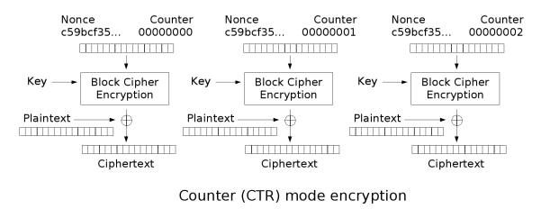
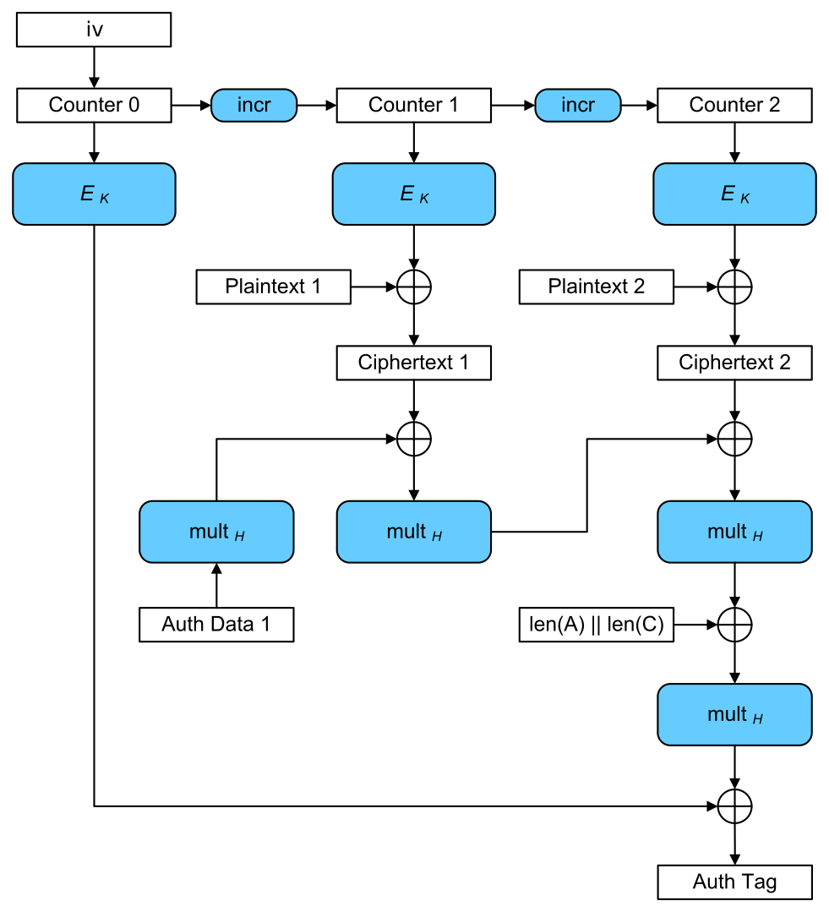

Kryptographie und Softwaresicherheit
====================================

<!-- START doctoc generated TOC please keep comment here to allow auto update -->
<!-- DON'T EDIT THIS SECTION, INSTEAD RE-RUN doctoc TO UPDATE -->
**Inhaltsverzeichnis**

- [Prüfungen](#pr%C3%BCfungen)
- [Einführung und Inhalt](#einf%C3%BChrung-und-inhalt)
- [Symmetrische Verfahren](#symmetrische-verfahren)
- [Asymmetrische Verfahren](#asymmetrische-verfahren)
  - [...SA vs ...DH](#sa-vs-dh)
- [Hybride Verfahren](#hybride-verfahren)
- [Krypto-Analyse](#krypto-analyse)
- [Anforderungen](#anforderungen)
  - [Anforderungen an Zukunft](#anforderungen-an-zukunft)
- [Verschlüsselung langer Daten](#verschl%C3%BCsselung-langer-daten)
  - [ECB (Electronic Code Book Mode)](#ecb-electronic-code-book-mode)
  - [CBC (Cipher Block Chaining Mode)](#cbc-cipher-block-chaining-mode)
  - [CFB (Cipher Feedback Mode)](#cfb-cipher-feedback-mode)
  - [CTR (Counter Mode)](#ctr-counter-mode)
  - [OFB (Output Feedback Mode)](#ofb-output-feedback-mode)
  - [GCM (Galois/Counter Mode)](#gcm-galoiscounter-mode)
- [Hashes & Signatur](#hashes--signatur)
  - [Kollisionen](#kollisionen)
  - [Hash-Verfahren](#hash-verfahren)
  - [Anwendung](#anwendung)
  - [Signaturen](#signaturen)
    - [Voraussetzungen](#voraussetzungen)
  - [Public-Key-Infrastruktur](#public-key-infrastruktur)
  - [Informationen in einem Zertifikat](#informationen-in-einem-zertifikat)
  - [Überprüfung eines Zertifikates](#%C3%BCberpr%C3%BCfung-eines-zertifikates)
  - [Aufgaben einer CA](#aufgaben-einer-ca)
  - [Sperrungen von Zertifikaten](#sperrungen-von-zertifikaten)
  - [Probleme beim CA-System](#probleme-beim-ca-system)
  - [Web of Trust](#web-of-trust)
- [Anwendung: PGP, De-Mail](#anwendung-pgp-de-mail)
  - [Email-Verschlüsselung](#email-verschl%C3%BCsselung)
  - [Email-Authentizität](#email-authentizit%C3%A4t)
  - [PGP](#pgp)
    - [Probleme von PGP](#probleme-von-pgp)
  - [De-Mail](#de-mail)
    - [Sicherheit von De-Mail](#sicherheit-von-de-mail)
- [Anwendung: Bitcoin (Blockchain)](#anwendung-bitcoin-blockchain)
  - [Konsensproblem](#konsensproblem)

<!-- END doctoc generated TOC please keep comment here to allow auto update -->

<!--newpage-->

# Prüfungen

- Klausur wäre bevorzugt
- Alternativ: Referate über freies Thema, was zu SWS passt
- MPP1: Krypto wird sehr gern geprüft

# Einführung und Inhalt

- Kryptographie = Lehre der Verschlüsselung
- dieses Modul umfasst weiterhin:
  - Verschlüsselungsverfahren
  - (kryptografische) Hashes
  - Signaturen + Zertifikate
  - Anwendung: PGP, De-Mail
  - Anwendung: Blockchain z.B. Bitcoin
  - Kryptographische Zufallszahlen
  - Passwörter
  - Steganographie
  - Anwendung: Disk Encryption
  - Anwendung: TPM
  - Typische Sicherheitslücken, sichere Programmierung
- Vorlesungsziel: Verständnis und Sensibilisierung
  - nicht Ziel: Exakte Detail-Kenntnisse von Algorithmen, Praktische Programmierung, Mathematik, Netzwerkverschlüsselung, IT-Sicherheit - sprengen den Rahmen
- Ziele / Anwendung krypt. Verfahren
  - Geheimhaltung, Vertraulichkeit, Zugriffsschutz: Verschlüsselungsverfahren
  - Integrität: Datensicherheit, krypt. Hash-Funktionen
  - Authentizität: Nichtabstreitbarkeit, Sicherstellung des Senders: Signaturen und Zertifikate
  - Authentifizierung und Passwörter
- Krypto-Algorithmen nie selbst programmieren
- lieber für gut befundene Implementierungen nutzen, bevorzugt Open-Source

# Symmetrische Verfahren

- **selber Schlüssel zum Ver- und Ent-schlüsseln**
- manchmal auch denselben Algorithmus
- arbeiten blockweise, typischerweise zwischen 64 Bit und 512 Bit
- typische Schlüssellänge: 128-256 Bit (Hinweis: 64 Bit sind zu wenig!)
- basieren auf einfachen Bit-Operationen: XOR, Shifts, Rotation, Plus/Minus, Permutationen
  - nur Shift + XOR reicht nicht
  - meist keine Multiplikationen usw., da zu langsam
- relativ einfache Algorithmen, oft in mehreren "Runden" wiederholt
- in HW implementierbar: "Krypto-Beschleuniger"
- Vektor-Einheiten, d.h. SSE/AVX kann verwendet werden
- müssen schnell sein (100MB/s)
- Beispiele:
  - DES (56 Bits, unsicher)
  - Triple-DES
  - IDEA (unfrei)
  - AES / Rijndael (schlechteste Sicherheit, beste Performance v.a. in HW)
  - (Blowfish), Twofish, Serpent (sind weitere, sichere Verfahren)
  - CAST, MARS, CR6
- Problem: Sender und Empfänger braucht denselben Schlüssel
  - Schlüsseltausch - wie wird der Schlüssel sicher übertragen (z.B. über Internet), ohne dass Dritter abfangen kann

# Asymmetrische Verfahren

- Verwendung eines Schlüssel-Paars
  - "öffentlicher" Schlüssel zum Verschlüsseln
  - "privater" Schlüssel zum Entschlüsseln
- Daher auch: Public-Key-Verfahren
- Private Key und Public Key können auch Rollen tauschen, z.B. beim Signieren
- Empfänger berechnet einmalig persönliches Schlüsselpaar, veröffentlicht öff. Schlüssel und verwahrt priv. Schlüssel sicher
- arbeiten ebenfalls blockweise, aber mit größeren Block- und Schlüssel-Längen: 2048 bis 4096, darunter evtl. zu wenig
- Arbeiten intern mit 2048-Bit-Ints, also etwa 600 Dezimalstellen, Multiplikation, Restrechnung,...
- aufwändiger, langsamer
- schlecht durch Hardware- oder Vektor-Befehle zu beschleunigen
- unterschiedliche Algorithmen zum Ver- + Entschlüsseln
- basieren auf Problemen der diskreten Mathematik
  - in einer Richtung schnell (Schlüsselgenerierung)
  - in anderer Richtung extrem aufwändig (berechnen d. priv. Schlüssels mit öff.)
  - **"Einweg-Funktionen"**
- Bsp. 1: Faktorisierung großer Zahlen
  - für zwei große Primzahlen $p$ und $q$
  - $n = p * q$ leicht zu berechnen
  - Berechnung von $p$ und $q$ aus $n$ praktisch unmöglich
- Bsp. 2: Diskreter Logarithmus
  - $a^x \text{kongruent} m \text{mod} p$
  - für $a,x,m,p$ ganzzahlig
  - leicht für $m$ gesucht, $a,x,p$ gegeben
  - sehr schwer für $a,m,p$ gegeben und kleinstes lösendes $x$ gesucht
  - Anwendung: **Diffie-Hellman, DSH, Elgamal**
- ähnliche Idee: ECC = **elliptische Kurven**
- im Wesentlichen auch diskreter Logarithmus, aber nicht mit ganzen Zahlen, sondern Punkten auf Kurven
  - Rechenschritte schwieriger, schlechter auf HW optimierbar, aber kürzere Schlüssel ausreichend
  - Bsp.: ECDSA für Signaturen, ECDH für Schlüsseltausch; Curve25519 gilt als bestes Verfahren

## ...SA vs ...DH

- DH verwendet zusätzlich Zufallszahlen
  - bietet "Forward secrecy"; RSA nicht
- Kenntnis d. priv. asym. Keys sorgt für:
  - aufgezeichnete verschlüsselte Daten nicht entschlüsselbar
  - symm. Keys nicht nachträglich knackbar
  - alte Sessions nicht nachträglich knackbar
- Kennntnis d. sym. Keys einer Session heißt nicht, dass andere Sessions geknackt werden können
- DH heißt, es wird innerhalb einer asym. Verschlüsselung eine sym. Verschlüsselung verwendet, für die mit jeder neuen Session ein neuer Schlüssel generiert wird

# Hybride Verfahren

- Praxis: Kombination beider Verfahren, z.B. SSL/TLS, IPsec, PGP,...
- zuerst asym. Verfahren zum Schlüsseltausch, dann symmetrisch verschlüsselt
- asym. Verfahren sorgt also für die sichere Übertragung des symmetrischen Schlüssels, da symmetrische Verschlüsselungsverfahren wesentlich schneller sind

# Krypto-Analyse

- Ziel: Angriff auf Kryptographie $\rightarrow$ Klartext herausfinden, Schlüssel herausfinden

> **Ein Verschlüsselungsverfahren ist gebrochen, wenn das mit deutlich weniger Aufwand als *Brute Force* gelingt**

# Anforderungen

- kein statistischer / struktureller Zusammenhang zw. Klartext und Chiffrat: **"pseudo-zufälliger Output"**
- keine erkennbare Zusammenhänge *bestimmte Bits im Input / Schlüssel* $\leftrightarrow$ *Bestimmte Bits im Output*
- keine Beschreibung durch ein algebraisches Gleichungssystem
  - verhindert u.a. statistische Analysen (z.B. Zeichenhäufigkeit)
- Beständigkeit gegen **"Known Plaintext"-Attacken**:
  - Klartext und Chiffrat bekannt (zumindest in Teilen)
  - Schlüssel gesucht
  - Extremfall: Krypto-Box in Händen des Angreifers
- Sonderfall **Differenzielle Analyse**
  - kleine Änderung im Original - Rückschluss auf Schlüsselteile aus resultierenden Änderungen im Chiffrat?
  - Anforderung **Lawinen-Effekt = Diffusion**: kleine Änderungen im Klartext bewirken große Änderungen im Chiffrat; sollte immer 50% sein
- Beständigkeit gegen **Seitenkanal-Attacken**
  - Timing- und Stromverbrauchs-Analyse
  - Rückschlüsse aus Sprung- und Cache-Verhalten
  - Analyse der Funk-Abstrahlung
  - **Der Algorithmus muss für Beobachter von außen für alle Inputs + Schlüssel *gleich* rechnen**

## Anforderungen an Zukunft

- "Quantencomputer-feste" Algorithmen
  - bei AES wird effektive Schlüssellänge halbiert
  - faktorisieren / logarithmieren in polynomialer Zeit

# Verschlüsselung langer Daten

- Problemstellung: wie bisherige Verfahren für lange Datenströme nutzen? (Blockchiffre zu Stromchiffre)

## ECB (Electronic Code Book Mode)

- Datenstrom in Blöcke teilen \rightarrow\rightarrow jeden Block separat verschlüsseln
- Nachteile:
  - Gleicher Block = gleiches Chiffrat (Rückschlüsse möglich)
  - Block-Reihenfolge evtl. unbemerkt verfälschbar
- Vorteil: Wiederaufsetzen nach Fehlern / Verlusten (wenn nur ein Block kaputt)

<!--width=600px-->

## CBC (Cipher Block Chaining Mode)

- bei jedem Block wird vor der Verschlüsselung `XOR` mit vorherigem Chiffrat durchgeführt
- Beim ersten Block XOR mit Initialisierungsvektor, z.B. Zufalllszahl
- Problem mit gleichen Blöcken behoben
- Vertauschung d. Reihenfolge fällt auf
- bei Fehler gehen 2 Blöcke verloren

<!--width=600px-->

## CFB (Cipher Feedback Mode)

- Verkettung ähnlich CBC
- XOR mit Plaintext nach Verschlüsselung des vorigen Chiffrats
- selten verwendet

## CTR (Counter Mode)

- arbeitet pro Block, ohne Verkettung
- Verschlüsselung: Zufallszahl + fortlfd. Zähler
  - erzeugt jedes mal einen anderen pseudo-zufälligen Bitstrom
- Klartext wird danach damit verschlüsselt: XOR mit diesem Bitstrom
- Verschlüsselung + Entschlüsselung ident
- parallelisierbar
- vorausrechenbar (Verschlüsselungs-Berechnung hängt nicht vom Klartext ab)
- Echte Stromchiffre - kann Byte für Byte abeiten
- Bei Bitfehlern nur genau entsprechende Bits betroffen
  - d.h. verfälschbar

<!--width=601px-->

## OFB (Output Feedback Mode)

- s.o., aber statt Zähler wird Output verwendet

## GCM (Galois/Counter Mode)

- wie CTR, aber mit zusätzlicher Auth-Tag-Berechnung
- gilt als derzeit bestes Verfahren
- in vielen Standards verwendet
- Auth-Tag = Prüfsumme $\rightarrow$ fälschungssicher
- "GMAC": Nur Auth-Tag-Berechnung, unverschlüsselt

<!--width=600px-->

# Hashes & Signatur

- bei Dateien, Mails: nur Unverfälschtheit
- Hash + Signatur + Zertifikats-Infrastruktur: Unverfälschtheit, Authentizität, Vertrauenswürdigkeit, Nicht-Abstreitbarkeit
- Hash = Prüfsumme, Fingerabdruck
- oft fixe Länge und kürzer als Nachricht
  - daher bijektive Funktion
- Informationsverlust: Original-Nachricht nicht aus Hash herstellbar
- verschiedene Original-Nachrichten können gleichen Hash haben
- Anforderungen an kryptograph. Hashfkt.:
  - kollisionsresistent
  - Lawineneffekt: kleine Änderung in Original, große Änderung im Hash
  - Einweg-Funktion: darf nie *rückrechenbar* sein
- Hash gilt als gebrochen, wenn schneller als Brute-Force lösbar

## Kollisionen 

**Fall 1**

- gegeben, fix:
  - nur Hashwert
  - oder Nachricht A und deren Hashwert
- gesucht: andere Nachricht B, die denselben Hash ergibt
- B wird so konstruiert, dass
  - zu großen Teilen ident zu A
  - einer kleinen, gezielten Veränderung zu A
  - beliebig dazukonstruierte, möglichst unauffällige Veränderung zur "Korrektur" des Hashes

**Fall 2**

- gegeben: gewünschte Nachrichten-Schnipsel (z.B. Anfang)
- gesucht: 2 verschiedene Nachrichten, die den Schnipsel enthalten und denselben, aber nicht vorgegebenen Hash enthalten
- Verschicke B, aber behaupte, A wäre echte Nachricht
- meist leichter als Fall 1

## Hash-Verfahren

- MD4 / MD5: "Message Digest"; seit >10y geknackt
- SHA, SHA1: "Secure Hash Algorithm"; seit 2005 theoretisch geknackt
- SHA-2 = SHA-256, SHA-384, SHA-512: längere SHA-Varianten, noch sicher
- SHA-3

## Anwendung

- Unverfälschtheit garantieren
- Speicherung Passwörter
- lange, hochwertige Zufallszahlen
- OTP (One Time Passwords)
- Challenge-Response-Verfahren
- Blockchain
- wenn Hash-Funktion geknackt, werden Krypto-Zertifikate wertlos

## Signaturen

- Sender / Ersteller berechnet Hashwert, verschlüsselt Hash mit Private Key, verschickt Originaldaten plus Signatur (**enthält** verschlüsselten Hash)
- Empfänger entschlüsselt Signatur mit Public Key, berechnet Hash der Originaldaten + vergleicht
- jeder kann also Signatur prüfen

### Voraussetzungen

Das System ist nur vertrauenswürdig, solange:

- kein unbefugter Zugang zum Private Key
- Zusammenhang zwischen Schlüsselpaar und Identität der Person

Lösungsansätze:

zu 1.:

- **Qualifizierte elektronische Signatur**: privater Key auf Chipkarte gespeichert, verlässt Karte nie
- aktive Karte, kann rechnen, Signatur auf Karte berechnet
- Certificate Authority (CA) darf keine Kopie des Private Key haben

zu 2.: Nutzung von Zertifikaten: PKI / Public Key Infrastructure

- Sicherstellung der Vertrauenswürdigkeit von Public Keys
- Sicherstellung ihrer Zuordnung zu Person / Firma / Webserver / ...
- sichere Identifizierung

## Public-Key-Infrastruktur

- PKIs basieren auf Zertifikaten
- CA-Hierarchie
- Zertifikat ist Public Key + Zusatzdaten (z.B. Eigentümer)
- Zertifikat signiert mit **Key der CA**
  - d.h. überprüfbar, manipulationssicher,...

## Informationen in einem Zertifikat

- z.B. im genormten X.509-Format
- Public Key
- Eigentümer (Person, Firma, Domain,...)
- Zulässigkeit, z.B. für Domains bei HTTPS
- Austeller (=CA)
- Gültigkeitsbereich (Zeitraum)
- Versions- und Algorithmus-Informationen

## Überprüfung eines Zertifikates

- Signatur korrekt? / Daten unverfälscht?
- zeitlich noch gültig?
- oft: richtiges Zertifikat? / richtige Domain?
- wurde Zertifikat widerrufen? (Anfrage mittels OCSP oder CRL)
  - entspricht Blacklist
- Zertifikat vertrauenswürdig? / Zertifikatskette bis zur Root-CA OK?
  - entspricht Whitelist
- **Problem: wie prüft man den Key der CA?**
  - hierarchisches System \rightarrow\rightarrow übergeordnete CA signiert untergeordnete
  - **Root-CA** (es existieren ein paar hundert) werden von Betriebssystem / Browser gespeichert und gelten **ohne weitere Prüfung** als vertrauenswürdig
  - Bsp. Root-CAs: DigiCert, D-Trust,... (kosten viel Geld); LetsEncrypt, CaCert als Community-CAs

## Aufgaben einer CA

- prüfen Korrektheit, Identität und Berechtigungen des Antragstellers
- erzeugt Schlüsselpaar
- stellt Zertifikat für Public Key aus, übermittelt Private Key geheim an Antragsteller *(und löscht ihn dann hoffentlich)*
- führt Liste ihrer ausgestellten Zertifikate
- verwaltet Sperrliste

## Sperrungen von Zertifikaten

- wenn...
  - Private Key gestohlen
  - Daten des Beantragers stimmen nicht mehr
  - Kriminelle Aktivitäten des Beantragers
- Ungültigkeitserklärung vor Ablauf der Gültigkeit
- CRL = Certificate Revocation List oder Online-Zertifikats-Prüfdienst (OCSP)
- Browser / OS speichert CRL lokal
- auch: Sperre einer CA ($\rightarrow$ Sperre aller ausgestellten Zertifikate)
  - CA stellt Zertifikate an Unberechtigte aus
    - insb. Sub-CA-Zertifikate
  - privater Schlüssel wird kompromittiert
  - Angreifer bricht in CA ein
  - CA arbeitet unsicher, z.B. *verliert* Private Keys

## Probleme beim CA-System

- Kette kann irgendwo unterbrochen werden
  - alle darunterliegenden Elemente plötzlich ungültig
- Behebung für SSL-Zertifikate, ID-Karten,...: neue Zertifikate, hoher Aufwand
- Behebung bei signierten Dokumenten: **Keine!**
- Angriffspunkt lokale Root-CA-Liste: Manipulation
  - lokaler Rechner vertraut dann Angreifer
  - *böse* SSL-Server werden vertrauenswürdig
  - MITM-Angriffe möglich
- Erweiterung der Root-CA-Liste üblich für Corporate Virenscanner, SW-Auto-Update,...
  - **Just don't!**
- Beantragung von Zertifikaten kostet **Zeit, Aufwand, teilweise Geld**
  - Konsequenz: es werden Self-Signed Zertifikate verwendet $\rightarrow$ nicht gut

## Web of Trust

- nicht-hierarchische Alternative zu CAs (z.B. für PGP)
- zwei Beziehungen zwischen Teilnehmern
  - X **kennt** Y (persönlich)
    - X signiert Schlüssel von Y
  - X **vertraut** Y, dass Y nur Schlüssel von Personen signiert, die er tatsächlich kennt
- d.h.
  - X vertraut von Y signierten Schlüsseln
  - Y hat Schlüssel von Z als "bekannt" signiert
  - X betrachtet daher Schlüssel von Z als gültig
- kann weniger streng sein: auch indirekt über mehrere vertrauende Personen hinweg
- kann strenger sein: mehrere vertrauenswürdige Y müssen Z signiert haben
- Dazu notwendig: **Schlüsselserver**
  - enthalten Public Keys der Teilnehmer, gegenseitig ausgestellte Signaturen
- Datenschutz-relevant: Namen, Mail-Adressen, "kennt" und "vertraut"-Informationen sind sensible Informationen

# Anwendung: PGP, De-Mail

## Email-Verschlüsselung

- Standardmäßig keine End-to-End-Verschlüsselung
- Mails liegen in Klartext auf Hops
- Verschlüsselung **bestenfalls** Host-to-Host
  - Zwischen zwei Servern
  - Zwischen Server und Client
- Prinzip: kleinster gemeinsamer Nenner: verschlüsselungs-unwilliger Server heißt, dass Klartext genutzt wird

## Email-Authentizität

- Header sind "Schall und Rauch": weder Verschlüsselung noch Prüfsumme möglich
- Header können schon beim Absender, aber auch von jedem Zwischenserver gefälscht werden

## PGP

- Lösungsansatz für die beiden obigen Kapitel
- "Pretty Good Privacy"
- durch RFC4880 standardisiert \rightarrow\rightarrow freie Implementierungen: OpenPGP und GPG
- Kombination aus sym. + asym. Verschlüsselung
- falls gewünscht, wird Signatur zur Nachricht (verschlüsselt mit dem Private Key des Senders) beigefügt
- mit zufällig erzeugtem Schlüssel wird Nachricht symmetrisch verschlüsselt
- sym. Schlüssel wird asym. mit Elgamal verschlüsselt 
- aufgrund technischer Beschränkungen wird Base64 kodiert

### Probleme von PGP

- Sicherheit des Schlüsselrings
- Authentizität: Wer garantiert die Zuordnung zwischen Schlüsseln und Personen?

## De-Mail

- technisch normales Mail-Format mit TLS, IMAP/POP, SMTP
- Zwei-Faktor-Authentifizierung, aber qualifizierte Signatur keine Pflicht
- Sende-/Empfangs-Nachweise vom Dienstanbieter signiert
- organisatorisch nur von zertifizierten Anbietern; durch Ausweisprüfung identifizierte Benutzerkonten

### Sicherheit von De-Mail

- verpflichtend: Host-to-Host-**Inhalts**-Verschlüsselung
  - ergibt keinen Sinn, da Inhalt auf Servern entschlüsselt
- End-to-End ist optional, muss vom Sender / Empfänger mit z.B. PGP erfolgen, aber **zentraler Keyserver**
- Hashwert für Integrität optional: Signatur am ersten / letzten Server, nicht am Client
- Viele Datenschutz-Aspekte offen:
  - Vorratsdatenspeicherung?
  - großzügiger Zugriff auf Personendaten, Mails und De-Mail-**Passwort** durch BKA <!--hmm wie werden die Passwörter dann wohl gespeichert?-->
- daher nicht vertraulich / geheim und daher zu vermeiden

# Anwendung: Bitcoin (Blockchain)

- ist Blockchain-basierte Speicherug von Transaktionen zwischen Wallets
- ist P2P-Netzwerk, die Daten über Transaktionen und Blöcke in der Blockchain austauschen
- ist ein Protokoll und den Implementierungen
- Erzeugung und Unverfälschbarkeit: Hashing mit SHA-256
- Absicherung der Wallets
- Signatur mit 256 Bit ECDSA
- jeder Block enthält kryptografischen Hash des **vorigen** Blocks, Zeitstempel, *beliebige Nutzdaten*
- jede nachträgliche Veränderung ist erkennbar
- Verwendung für Alles, was fälschungssicher protokolliert werden muss (Prüfprotokolle, Lieferketten, Transaktionen, ...)
- alle Blöcke vorher müssen erhalten bleiben \rightarrow\rightarrow Bitcoin-Blockchain derzeit 340GB (stetig wachsend)
- ```
- jeder Block enthält variable Zusatzbits (Nonce), die durch "Mining" bestimmt werden
- dezentral gespeichert $\rightarrow$ viele gleichberechtigte Kopien auf der Welt verteilt
- asynchrone Kommunikation (d.h. langsam, verzögert, unzuverlässig)

## Konsensproblem

- Wer darf anhängen? Welcher neue Block wird unter Konkurrierenden akzeptiert?
- Kollisionsbehandlung mit Proof of Work und Regelwerk
  - Warten, bis ein weiterer Block angehängt wird
  - längste Kette gewinnt
  - Blöcke der Verlierer wandern zurück in den Pool der unbestätigten Transaktionen
- Manipulationssicherheit des System bricht zusammen, wenn ein Teilnehmer >50% der Rechenleistung kontrolliert
